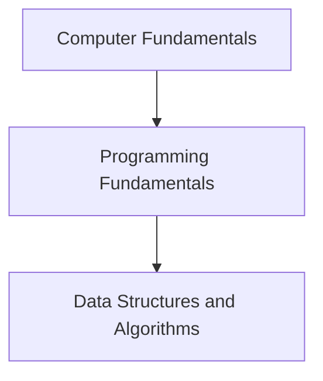

# Foundations

<!-- Generated map: edit curriculum.yaml, then run scripts/curriculum.py build. -->

[Master curriculum](../CURRICULUM.md) · [Model and editing guide](../CONTRIBUTING.md)

## Purpose

Build the vocabulary and reasoning skills used throughout computing.

## Prerequisites

None — entry concept.

These orient entry into the domain; each topic below has its own requirements. They are not inherited gates.

## Recommended Learning Order

This is one dependency-compatible reading order. External prerequisites can be learned in parallel; numbering is guidance, not a completion checklist.

1. [Computer Fundamentals](README.md#computer-fundamentals)
2. [Programming Fundamentals](README.md#programming-fundamentals)
3. [Data Structures and Algorithms](README.md#data-structures-algorithms)

## Major Areas

### Computing Literacy

#### Computer Fundamentals

**Concepts:** Hardware and software; Input and output; Binary; Bits and bytes; Units and encodings.

**Prerequisites:** None — entry concept.

### Programming Basics

#### Programming Fundamentals

**Concepts:** Variables; Data types; Control flow; Functions; Error handling.

**Prerequisites:** [[00-foundations/README#Computer Fundamentals|Computer Fundamentals]] · [Computer Fundamentals](README.md#computer-fundamentals)

#### Data Structures and Algorithms

**Concepts:** Arrays; Lists; Maps; Trees; Searching; Sorting; Complexity.

**Prerequisites:** [[00-foundations/README#Programming Fundamentals|Programming Fundamentals]] · [Programming Fundamentals](README.md#programming-fundamentals)

## Dependency Sketch

Selected direct prerequisite edges, not the entire domain graph. Arrows mean “learn before”.

## Leads To

[[01-computer-systems/README#Computer Architecture|Computer Architecture]] · [Computer Architecture](../01-computer-systems/README.md#computer-architecture); [[02-operating-systems/README#Concurrency|Concurrency]] · [Concurrency](../02-operating-systems/README.md#concurrency); [[03-linux/README#Linux Shell|Linux Shell]] · [Linux Shell](../03-linux/README.md#linux-shell); [[04-networking/README#OSI Model|OSI Model]] · [OSI Model](../04-networking/README.md#osi-model); [[05-programming/README#Python Automation|Python Automation]] · [Python Automation](../05-programming/README.md#python-automation); [[05-programming/README#Program Dependencies and Packaging|Program Dependencies and Packaging]] · [Program Dependencies and Packaging](../05-programming/README.md#program-dependencies); [[06-software-engineering/README#Software Lifecycle and Requirements|Software Lifecycle and Requirements]] · [Software Lifecycle and Requirements](../06-software-engineering/README.md#software-lifecycle); [[06-software-engineering/README#Software Design Principles|Software Design Principles]] · [Software Design Principles](../06-software-engineering/README.md#software-design); [[08-databases/README#Data Modeling|Data Modeling]] · [Data Modeling](../08-databases/README.md#data-modeling); [[12-infrastructure-as-code/README#Desired State and Reconciliation|Desired State and Reconciliation]] · [Desired State and Reconciliation](../12-infrastructure-as-code/README.md#desired-state); [[17-observability/README#Telemetry and Observability|Telemetry and Observability]] · [Telemetry and Observability](../17-observability/README.md#telemetry); [[18-security/README#Security Fundamentals|Security Fundamentals]] · [Security Fundamentals](../18-security/README.md#security-fundamentals); [[19-distributed-systems/README#Idempotency|Idempotency]] · [Idempotency](../19-distributed-systems/README.md#idempotency); [[21-system-design/README#Caching|Caching]] · [Caching](../21-system-design/README.md#caching)
