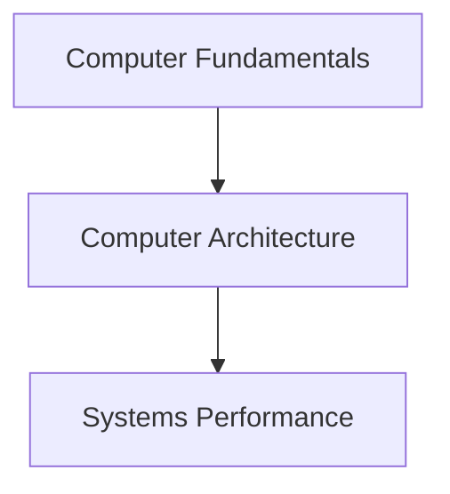

# Computer Systems

<!-- Generated map: edit curriculum.yaml, then run scripts/curriculum.py build. -->

[Master curriculum](../CURRICULUM.md) · [Model and editing guide](../CONTRIBUTING.md)

## Purpose

Understand how hardware executes programs and where resource limits arise.

## Prerequisites

[[00-foundations/README#Computer Fundamentals|Computer Fundamentals]] · [Computer Fundamentals](../00-foundations/README.md#computer-fundamentals)

These orient entry into the domain; each topic below has its own requirements. They are not inherited gates.

## Recommended Learning Order

This is one dependency-compatible reading order. External prerequisites can be learned in parallel; numbering is guidance, not a completion checklist.

1. [Computer Architecture](README.md#computer-architecture)
2. [Systems Performance](README.md#systems-performance)

## Major Areas

### Hardware and Execution

#### Computer Architecture

**Concepts:** CPU; Instruction execution; Caches; Memory; Storage; I/O.

**Prerequisites:** [[00-foundations/README#Computer Fundamentals|Computer Fundamentals]] · [Computer Fundamentals](../00-foundations/README.md#computer-fundamentals)

#### Systems Performance

**Concepts:** Locality; CPU bottlenecks; Memory bandwidth; Storage latency.

**Prerequisites:** [[01-computer-systems/README#Computer Architecture|Computer Architecture]] · [Computer Architecture](README.md#computer-architecture)

## Dependency Sketch

Selected direct prerequisite edges, not the entire domain graph. Arrows mean “learn before”.

## Leads To

[[02-operating-systems/README#Operating System Fundamentals|Operating System Fundamentals]] · [Operating System Fundamentals](../02-operating-systems/README.md#os-fundamentals); [[14-kubernetes/README#Kubernetes Scheduling and Resources|Kubernetes Scheduling and Resources]] · [Kubernetes Scheduling and Resources](../14-kubernetes/README.md#kubernetes-scheduling); [[20-sre/README#Capacity and Performance|Capacity and Performance]] · [Capacity and Performance](../20-sre/README.md#capacity-performance)
