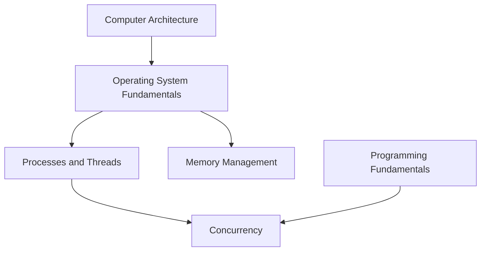

# Operating Systems

<!-- Generated map: edit curriculum.yaml, then run scripts/curriculum.py build. -->

[Master curriculum](../CURRICULUM.md) · [Model and editing guide](../CONTRIBUTING.md)

## Purpose

Understand resource isolation, scheduling, and the interfaces between programs and hardware.

## Prerequisites

[[01-computer-systems/README#Computer Architecture|Computer Architecture]] · [Computer Architecture](../01-computer-systems/README.md#computer-architecture)

These orient entry into the domain; each topic below has its own requirements. They are not inherited gates.

## Recommended Learning Order

This is one dependency-compatible reading order. External prerequisites can be learned in parallel; numbering is guidance, not a completion checklist.

1. [Operating System Fundamentals](README.md#os-fundamentals)
2. [Processes and Threads](README.md#processes-threads)
3. [Memory Management](README.md#memory-management)
4. [Concurrency](README.md#concurrency)

## Major Areas

### Operating System Mechanics

#### Operating System Fundamentals

**Concepts:** Kernel; User space; System calls; Interrupts; Filesystems.

**Prerequisites:** [[01-computer-systems/README#Computer Architecture|Computer Architecture]] · [Computer Architecture](../01-computer-systems/README.md#computer-architecture)

#### Processes and Threads

**Concepts:** Process address spaces; Threads; Scheduling; Context switching.

**Prerequisites:** [[02-operating-systems/README#Operating System Fundamentals|Operating System Fundamentals]] · [Operating System Fundamentals](README.md#os-fundamentals)

#### Memory Management

**Concepts:** Virtual memory; Paging; Allocation; Page faults; Swap.

**Prerequisites:** [[02-operating-systems/README#Operating System Fundamentals|Operating System Fundamentals]] · [Operating System Fundamentals](README.md#os-fundamentals)

#### Concurrency

**Concepts:** Race conditions; Locks; Deadlocks; Synchronization; Parallelism.

**Prerequisites:** [[02-operating-systems/README#Processes and Threads|Processes and Threads]] · [Processes and Threads](README.md#processes-threads); [[00-foundations/README#Programming Fundamentals|Programming Fundamentals]] · [Programming Fundamentals](../00-foundations/README.md#programming-fundamentals)

## Dependency Sketch

Selected direct prerequisite edges, not the entire domain graph. Arrows mean “learn before”.

## Leads To

[[03-linux/README#Linux Filesystem|Linux Filesystem]] · [Linux Filesystem](../03-linux/README.md#linux-filesystem); [[03-linux/README#Linux Processes|Linux Processes]] · [Linux Processes](../03-linux/README.md#linux-processes); [[03-linux/README#Linux Troubleshooting|Linux Troubleshooting]] · [Linux Troubleshooting](../03-linux/README.md#linux-troubleshooting); [[08-databases/README#Database Transactions|Database Transactions]] · [Database Transactions](../08-databases/README.md#database-transactions); [[09-containers/README#Virtualization|Virtualization]] · [Virtualization](../09-containers/README.md#virtualization); [[09-containers/README#Container Fundamentals|Container Fundamentals]] · [Container Fundamentals](../09-containers/README.md#container-fundamentals); [[19-distributed-systems/README#Distributed Systems Fundamentals|Distributed Systems Fundamentals]] · [Distributed Systems Fundamentals](../19-distributed-systems/README.md#distributed-fundamentals); [[20-sre/README#Reliability Fundamentals|Reliability Fundamentals]] · [Reliability Fundamentals](../20-sre/README.md#reliability-fundamentals)
