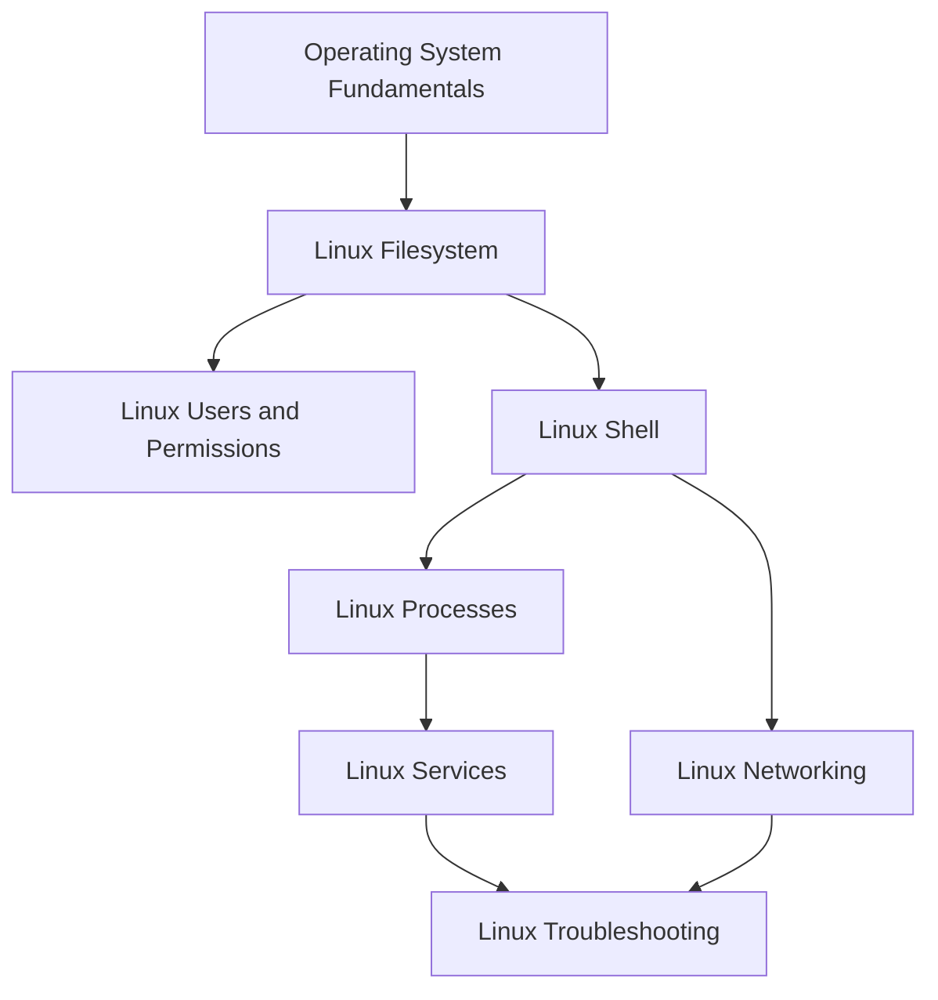

# Linux

<!-- Generated map: edit curriculum.yaml, then run scripts/curriculum.py build. -->

[Master curriculum](../CURRICULUM.md) · [Model and editing guide](../CONTRIBUTING.md)

## Purpose

Operate Linux systems and diagnose their behavior using operating system concepts.

## Prerequisites

[[02-operating-systems/README#Operating System Fundamentals|Operating System Fundamentals]] · [Operating System Fundamentals](../02-operating-systems/README.md#os-fundamentals)

These orient entry into the domain; each topic below has its own requirements. They are not inherited gates.

## Recommended Learning Order

This is one dependency-compatible reading order. External prerequisites can be learned in parallel; numbering is guidance, not a completion checklist.

1. [Linux Filesystem](README.md#linux-filesystem)
2. [Linux Shell](README.md#linux-shell)
3. [Linux Processes](README.md#linux-processes)
4. [Linux Services](README.md#linux-services)
5. [Linux Networking](README.md#linux-networking)
6. [Linux Troubleshooting](README.md#linux-troubleshooting)
7. [Linux Users and Permissions](README.md#linux-users-permissions)

## Major Areas

### System Fundamentals

#### Linux Filesystem

**Concepts:** Files; Directories; Inodes; Mounts; Paths; Package management.

**Prerequisites:** [[02-operating-systems/README#Operating System Fundamentals|Operating System Fundamentals]] · [Operating System Fundamentals](../02-operating-systems/README.md#os-fundamentals)

#### Linux Users and Permissions

**Concepts:** Users; Groups; Ownership; Mode bits; sudo; ACLs.

**Prerequisites:** [[03-linux/README#Linux Filesystem|Linux Filesystem]] · [Linux Filesystem](README.md#linux-filesystem); [[18-security/identity-access|Identity and Access Management]] · [Identity and Access Management](../18-security/identity-access.md)

**Implements / applies:** [[18-security/identity-access|Identity and Access Management]] · [Identity and Access Management](../18-security/identity-access.md)

#### Linux Shell

**Concepts:** Shell; Bash; Environment variables; Pipes; Redirection; Exit codes; Text manipulation; Terminal editors.

**Prerequisites:** [[03-linux/README#Linux Filesystem|Linux Filesystem]] · [Linux Filesystem](README.md#linux-filesystem); [[00-foundations/README#Programming Fundamentals|Programming Fundamentals]] · [Programming Fundamentals](../00-foundations/README.md#programming-fundamentals)

### Runtime and Operations

#### Linux Processes

**Concepts:** Process inspection; Threads; Signals; File descriptors; /proc.

**Prerequisites:** [[02-operating-systems/README#Processes and Threads|Processes and Threads]] · [Processes and Threads](../02-operating-systems/README.md#processes-threads); [[03-linux/README#Linux Shell|Linux Shell]] · [Linux Shell](README.md#linux-shell)

#### Linux Services

**Concepts:** systemd; Units; Service lifecycle; Dependencies; Journal logs.

**Prerequisites:** [[03-linux/README#Linux Processes|Linux Processes]] · [Linux Processes](README.md#linux-processes)

**Implements / applies:** [[12-infrastructure-as-code/README#Desired State and Reconciliation|Desired State and Reconciliation]] · [Desired State and Reconciliation](../12-infrastructure-as-code/README.md#desired-state)

#### Linux Networking

**Concepts:** Interfaces; Routes; Sockets; Resolver configuration; DNS resolution; SSH.

**Prerequisites:** [[03-linux/README#Linux Shell|Linux Shell]] · [Linux Shell](README.md#linux-shell); [[04-networking/README#Routing|Routing]] · [Routing](../04-networking/README.md#routing); [[04-networking/dns|DNS]] · [DNS](../04-networking/dns.md); [[04-networking/README#TCP|TCP]] · [TCP](../04-networking/README.md#tcp)

#### Linux Troubleshooting

**Concepts:** Logs; CPU saturation; Memory pressure; Disk exhaustion; Socket inspection.

**Prerequisites:** [[03-linux/README#Linux Services|Linux Services]] · [Linux Services](README.md#linux-services); [[03-linux/README#Linux Networking|Linux Networking]] · [Linux Networking](README.md#linux-networking); [[02-operating-systems/README#Memory Management|Memory Management]] · [Memory Management](../02-operating-systems/README.md#memory-management)

## Dependency Sketch

Selected direct prerequisite edges, not the entire domain graph. Arrows mean “learn before”.

## Leads To

[[05-programming/README#Python Automation|Python Automation]] · [Python Automation](../05-programming/README.md#python-automation); [[05-programming/README#Shell Automation|Shell Automation]] · [Shell Automation](../05-programming/README.md#shell-automation); [[07-git/README#Git Fundamentals|Git Fundamentals]] · [Git Fundamentals](../07-git/README.md#git-fundamentals); [[09-containers/README#Container Fundamentals|Container Fundamentals]] · [Container Fundamentals](../09-containers/README.md#container-fundamentals); [[09-containers/README#Container Storage|Container Storage]] · [Container Storage](../09-containers/README.md#container-storage); [[09-containers/README#Docker Networking|Docker Networking]] · [Docker Networking](../09-containers/README.md#docker-networking); [[13-configuration-management/README#Configuration Management Principles|Configuration Management Principles]] · [Configuration Management Principles](../13-configuration-management/README.md#configuration-management-principles); [[13-configuration-management/README#Ansible Automation|Ansible Automation]] · [Ansible Automation](../13-configuration-management/README.md#ansible-automation); [[22-production-operations/README#Backup and Disaster Recovery|Backup and Disaster Recovery]] · [Backup and Disaster Recovery](../22-production-operations/README.md#backup-recovery); [[23-advanced/README#Systems Performance Specialization|Systems Performance Specialization]] · [Systems Performance Specialization](../23-advanced/README.md#performance-specialization)

## Reference Roadmaps

Use these for coverage and further exploration; the prerequisite relationships here are curated independently.

- [roadmap.sh — Network Engineer](https://roadmap.sh/network-engineer)
- [roadmap.sh — DevOps](https://roadmap.sh/devops)

[Reference review and scope decisions](../references/roadmap-sh.md)
