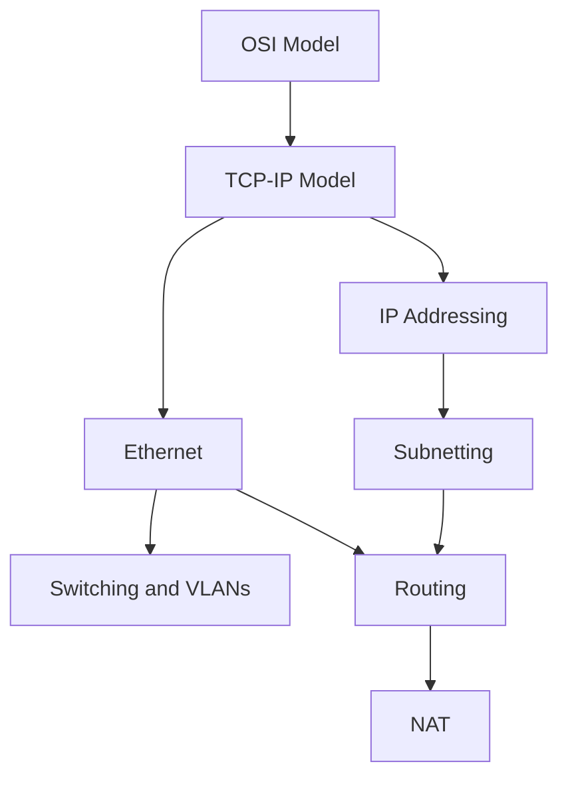

# Networking

<!-- Generated map: edit curriculum.yaml, then run scripts/curriculum.py build. -->

[Master curriculum](../CURRICULUM.md) · [Model and editing guide](../CONTRIBUTING.md)

## Purpose

Understand communication from local links through application protocols and traffic management.

## Prerequisites

[[00-foundations/README#Computer Fundamentals|Computer Fundamentals]] · [Computer Fundamentals](../00-foundations/README.md#computer-fundamentals)

These orient entry into the domain; each topic below has its own requirements. They are not inherited gates.

## Recommended Learning Order

This is one dependency-compatible reading order. External prerequisites can be learned in parallel; numbering is guidance, not a completion checklist.

1. [OSI Model](README.md#osi-model)
2. [TCP-IP Model](README.md#tcp-ip)
3. [Ethernet](README.md#ethernet)
4. [Switching and VLANs](README.md#switching-vlans)
5. [IP Addressing](ip-addressing.md)
6. [Subnetting](subnetting.md)
7. [Routing](README.md#routing)
8. [Dynamic Routing](README.md#dynamic-routing)
9. [TCP](README.md#tcp)
10. [NAT](README.md#nat)
11. [UDP](README.md#udp)
12. [DNS](dns.md)
13. [HTTP](README.md#http)
14. [TLS](README.md#tls)
15. [Proxies and Load Balancing](README.md#proxies-load-balancing)
16. [Network Troubleshooting](README.md#network-troubleshooting)
17. [Tunneling and VPNs](README.md#vpn-tunneling)
18. [Network Automation](README.md#network-automation)

## Major Areas

### Models and Local Links

#### OSI Model

**Concepts:** Layers; Encapsulation; Model limitations.

**Prerequisites:** [[00-foundations/README#Computer Fundamentals|Computer Fundamentals]] · [Computer Fundamentals](../00-foundations/README.md#computer-fundamentals)

#### TCP-IP Model

**Concepts:** Link layer; Internet layer; Transport layer; Application layer.

**Prerequisites:** [[04-networking/README#OSI Model|OSI Model]] · [OSI Model](README.md#osi-model)

#### Ethernet

**Concepts:** Frames; MAC addresses; Switching; ARP.

**Prerequisites:** [[04-networking/README#TCP-IP Model|TCP-IP Model]] · [TCP-IP Model](README.md#tcp-ip)

#### Switching and VLANs

**Concepts:** MAC learning; Broadcast domains; VLANs; Trunks; Loop prevention; Spanning tree; Link aggregation.

**Prerequisites:** [[04-networking/README#Ethernet|Ethernet]] · [Ethernet](README.md#ethernet)

### Addressing and Routing

#### IP Addressing

**Concepts:** IP; IPv4; IPv6; Public and private addresses; DHCP.

**Prerequisites:** [[04-networking/README#TCP-IP Model|TCP-IP Model]] · [TCP-IP Model](README.md#tcp-ip)

**Topic note:** [[04-networking/ip-addressing|IP Addressing]] · [IP Addressing](ip-addressing.md)

**Related:** [[04-networking/README#Ethernet|Ethernet]] · [Ethernet](README.md#ethernet); [[18-security/README#Network Security|Network Security]] · [Network Security](../18-security/README.md#network-security)

#### Subnetting

**Concepts:** CIDR; Prefixes; Subnet boundaries; IPv4 and IPv6 allocation.

**Prerequisites:** [[04-networking/ip-addressing|IP Addressing]] · [IP Addressing](ip-addressing.md)

**Topic note:** [[04-networking/subnetting|Subnetting]] · [Subnetting](subnetting.md)

**Related:** [[04-networking/ip-addressing|IP Addressing]] · [IP Addressing](ip-addressing.md); [[11-aws/README#AWS VPC|AWS VPC]] · [AWS VPC](../11-aws/README.md#aws-vpc)

#### Routing

**Concepts:** Route lookup; Longest-prefix match; Default gateways; Route tables.

**Prerequisites:** [[04-networking/subnetting|Subnetting]] · [Subnetting](subnetting.md); [[04-networking/README#Ethernet|Ethernet]] · [Ethernet](README.md#ethernet)

#### NAT

**Concepts:** Source NAT; Destination NAT; Connection tracking; Port translation.

**Prerequisites:** [[04-networking/README#Routing|Routing]] · [Routing](README.md#routing); [[04-networking/README#TCP|TCP]] · [TCP](README.md#tcp)

#### Dynamic Routing

**Concepts:** Route advertisement; Metrics; Convergence; OSPF; BGP; Routing policy.

**Prerequisites:** [[04-networking/README#Routing|Routing]] · [Routing](README.md#routing)

### Transport and Application Protocols

#### TCP

**Concepts:** Ports; Three-way handshake; Sequence numbers; Retransmission; Flow and congestion control.

**Prerequisites:** [[04-networking/ip-addressing|IP Addressing]] · [IP Addressing](ip-addressing.md)

#### UDP

**Concepts:** Datagrams; Ports; Loss; Application-managed reliability.

**Prerequisites:** [[04-networking/ip-addressing|IP Addressing]] · [IP Addressing](ip-addressing.md)

#### DNS

**Concepts:** Zones; Records; Recursive resolution; Authoritative servers; Caching; TTL.

**Prerequisites:** [[04-networking/README#UDP|UDP]] · [UDP](README.md#udp); [[04-networking/README#TCP|TCP]] · [TCP](README.md#tcp)

**Topic note:** [[04-networking/dns|DNS]] · [DNS](dns.md)

**Related:** [[04-networking/README#HTTP|HTTP]] · [HTTP](README.md#http); [[14-kubernetes/README#Kubernetes Networking|Kubernetes Networking]] · [Kubernetes Networking](../14-kubernetes/README.md#kubernetes-networking); [[11-aws/README#AWS Traffic and DNS|AWS Traffic and DNS]] · [AWS Traffic and DNS](../11-aws/README.md#aws-traffic)

#### HTTP

**Concepts:** Methods; Status codes; Headers; Caching semantics; HTTPS; Connection reuse.

**Prerequisites:** [[04-networking/README#TCP|TCP]] · [TCP](README.md#tcp); [[04-networking/dns|DNS]] · [DNS](dns.md)

#### TLS

**Concepts:** Handshake; Certificates; Peer verification; Transport encryption.

**Prerequisites:** [[04-networking/README#TCP|TCP]] · [TCP](README.md#tcp); [[18-security/README#Cryptography and PKI|Cryptography and PKI]] · [Cryptography and PKI](../18-security/README.md#pki)

**Related:** [[04-networking/README#HTTP|HTTP]] · [HTTP](README.md#http)

### Traffic Management and Diagnosis

#### Proxies and Load Balancing

**Concepts:** Forward proxy; Reverse proxy; L4 and L7 balancing; Health checks; Web servers; NGINX; HAProxy; Caddy.

**Prerequisites:** [[04-networking/README#HTTP|HTTP]] · [HTTP](README.md#http); [[04-networking/README#TLS|TLS]] · [TLS](README.md#tls)

#### Network Troubleshooting

**Concepts:** Layered diagnosis; Packet capture; DNS failures; Connection timeouts; ICMP; ping; traceroute; Wireshark; MTU diagnosis.

**Prerequisites:** [[04-networking/README#Routing|Routing]] · [Routing](README.md#routing); [[04-networking/dns|DNS]] · [DNS](dns.md); [[04-networking/README#TLS|TLS]] · [TLS](README.md#tls); [[18-security/README#Network Security|Network Security]] · [Network Security](../18-security/README.md#network-security)

#### Tunneling and VPNs

**Concepts:** Encapsulation; Site-to-site access; Remote access; IPsec; Tunnel MTU; Route overlap.

**Prerequisites:** [[04-networking/README#Routing|Routing]] · [Routing](README.md#routing); [[04-networking/README#TLS|TLS]] · [TLS](README.md#tls); [[18-security/README#Network Security|Network Security]] · [Network Security](../18-security/README.md#network-security)

#### Network Automation

**Concepts:** Device APIs; Configuration validation; NETCONF; RESTCONF; YANG; Configuration backup.

**Prerequisites:** [[04-networking/README#Routing|Routing]] · [Routing](README.md#routing); [[05-programming/README#Python Automation|Python Automation]] · [Python Automation](../05-programming/README.md#python-automation); [[13-configuration-management/README#Configuration Management Principles|Configuration Management Principles]] · [Configuration Management Principles](../13-configuration-management/README.md#configuration-management-principles)

## Dependency Sketch

Selected direct prerequisite edges, not the entire domain graph. Arrows mean “learn before”.

## Leads To

[[03-linux/README#Linux Networking|Linux Networking]] · [Linux Networking](../03-linux/README.md#linux-networking); [[05-programming/README#Network Programming|Network Programming]] · [Network Programming](../05-programming/README.md#network-programming); [[06-software-engineering/README#API Design|API Design]] · [API Design](../06-software-engineering/README.md#api-design); [[09-containers/README#Docker Networking|Docker Networking]] · [Docker Networking](../09-containers/README.md#docker-networking); [[10-cloud/README#Cloud Fundamentals|Cloud Fundamentals]] · [Cloud Fundamentals](../10-cloud/README.md#cloud-fundamentals); [[11-aws/README#AWS VPC|AWS VPC]] · [AWS VPC](../11-aws/README.md#aws-vpc); [[11-aws/README#AWS Traffic and DNS|AWS Traffic and DNS]] · [AWS Traffic and DNS](../11-aws/README.md#aws-traffic); [[14-kubernetes/README#Kubernetes Networking|Kubernetes Networking]] · [Kubernetes Networking](../14-kubernetes/README.md#kubernetes-networking); [[14-kubernetes/kubernetes-services|Kubernetes Services]] · [Kubernetes Services](../14-kubernetes/kubernetes-services.md); [[14-kubernetes/README#Kubernetes Ingress and Gateway API|Kubernetes Ingress and Gateway API]] · [Kubernetes Ingress and Gateway API](../14-kubernetes/README.md#kubernetes-ingress); [[15-ci-cd/README#Deployment Strategies|Deployment Strategies]] · [Deployment Strategies](../15-ci-cd/README.md#deployment-strategies); [[17-observability/README#Prometheus and Grafana|Prometheus and Grafana]] · [Prometheus and Grafana](../17-observability/README.md#prometheus-grafana); [[18-security/README#Network Security|Network Security]] · [Network Security](../18-security/README.md#network-security); [[19-distributed-systems/README#Distributed Systems Fundamentals|Distributed Systems Fundamentals]] · [Distributed Systems Fundamentals](../19-distributed-systems/README.md#distributed-fundamentals); [[19-distributed-systems/README#Service Discovery|Service Discovery]] · [Service Discovery](../19-distributed-systems/README.md#service-discovery); [[21-system-design/README#Scalable Architecture|Scalable Architecture]] · [Scalable Architecture](../21-system-design/README.md#scalable-architecture); [[21-system-design/README#Content Delivery and Edge Caching|Content Delivery and Edge Caching]] · [Content Delivery and Edge Caching](../21-system-design/README.md#content-delivery); [[23-advanced/README#Service Mesh|Service Mesh]] · [Service Mesh](../23-advanced/README.md#service-mesh)

## Reference Roadmaps

Use these for coverage and further exploration; the prerequisite relationships here are curated independently.

- [roadmap.sh — Network Engineer](https://roadmap.sh/network-engineer)

[Reference review and scope decisions](../references/roadmap-sh.md)
