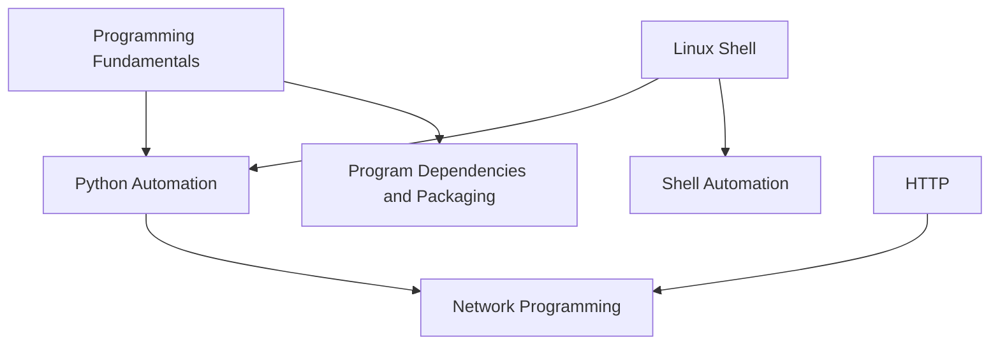

# Programming and Scripting

<!-- Generated map: edit curriculum.yaml, then run scripts/curriculum.py build. -->

[Master curriculum](../CURRICULUM.md) · [Model and editing guide](../CONTRIBUTING.md)

## Purpose

Turn programming fundamentals into reliable automation and maintainable programs.

## Prerequisites

[[00-foundations/README#Programming Fundamentals|Programming Fundamentals]] · [Programming Fundamentals](../00-foundations/README.md#programming-fundamentals); [[03-linux/README#Linux Shell|Linux Shell]] · [Linux Shell](../03-linux/README.md#linux-shell)

These orient entry into the domain; each topic below has its own requirements. They are not inherited gates.

## Recommended Learning Order

This is one dependency-compatible reading order. External prerequisites can be learned in parallel; numbering is guidance, not a completion checklist.

1. [Python Automation](README.md#python-automation)
2. [Shell Automation](README.md#shell-automation)
3. [Program Dependencies and Packaging](README.md#program-dependencies)
4. [Network Programming](README.md#network-programming)

## Major Areas

### Automation Languages

#### Python Automation

**Concepts:** Functions and modules; File I/O; Exceptions; Environments; API clients.

**Prerequisites:** [[00-foundations/README#Programming Fundamentals|Programming Fundamentals]] · [Programming Fundamentals](../00-foundations/README.md#programming-fundamentals); [[03-linux/README#Linux Shell|Linux Shell]] · [Linux Shell](../03-linux/README.md#linux-shell)

#### Shell Automation

**Concepts:** Quoting; Pipelines; Exit handling; Script interfaces; Safe retries.

**Prerequisites:** [[03-linux/README#Linux Shell|Linux Shell]] · [Linux Shell](../03-linux/README.md#linux-shell)

### Program Runtime

#### Program Dependencies and Packaging

**Concepts:** Libraries; Dependency resolution; Lockfiles; Packaging; Distribution.

**Prerequisites:** [[00-foundations/README#Programming Fundamentals|Programming Fundamentals]] · [Programming Fundamentals](../00-foundations/README.md#programming-fundamentals)

#### Network Programming

**Concepts:** Sockets; HTTP clients; Timeouts; Serialization.

**Prerequisites:** [[05-programming/README#Python Automation|Python Automation]] · [Python Automation](README.md#python-automation); [[04-networking/README#HTTP|HTTP]] · [HTTP](../04-networking/README.md#http)

## Dependency Sketch

Selected direct prerequisite edges, not the entire domain graph. Arrows mean “learn before”.

## Leads To

[[09-containers/README#Container Images|Container Images]] · [Container Images](../09-containers/README.md#container-images); [[15-ci-cd/README#Continuous Integration|Continuous Integration]] · [Continuous Integration](../15-ci-cd/README.md#ci-fundamentals); [[17-observability/README#OpenTelemetry|OpenTelemetry]] · [OpenTelemetry](../17-observability/README.md#opentelemetry); [[18-security/README#Supply Chain Security|Supply Chain Security]] · [Supply Chain Security](../18-security/README.md#supply-chain-security)
