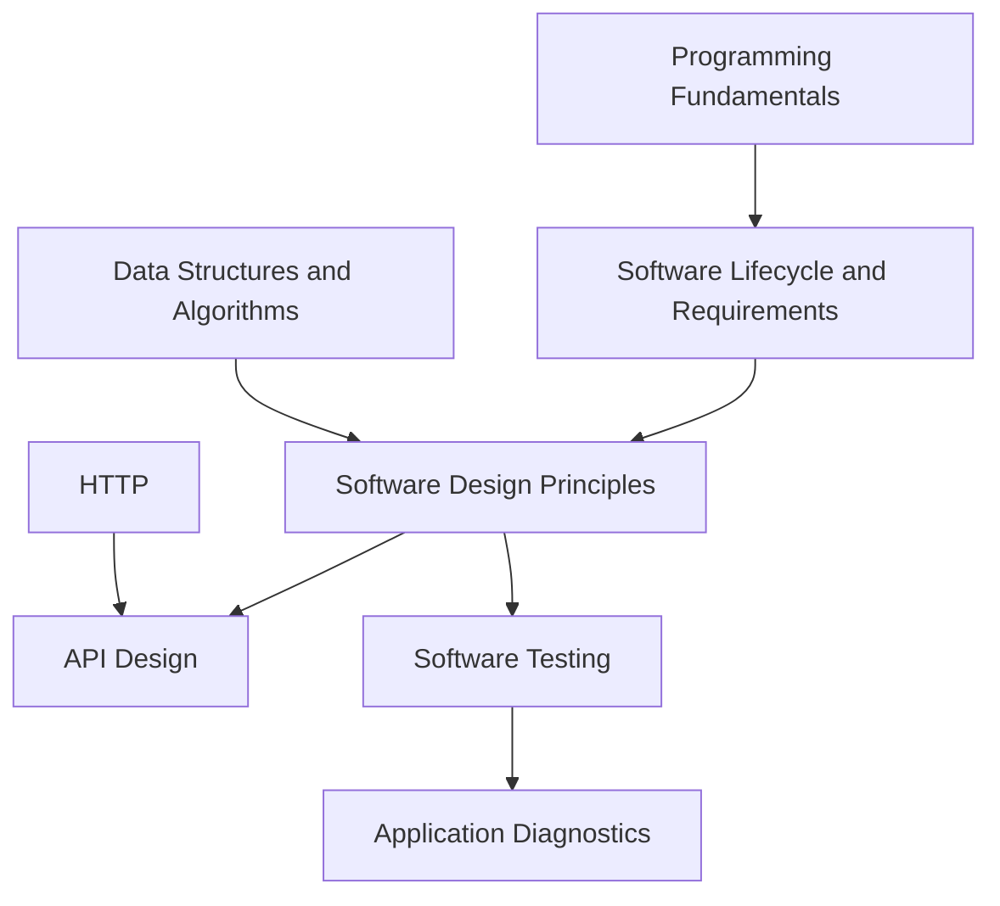

# Software Engineering

<!-- Generated map: edit curriculum.yaml, then run scripts/curriculum.py build. -->

[Master curriculum](../CURRICULUM.md) · [Model and editing guide](../CONTRIBUTING.md)

## Purpose

Design, test, and evolve software with explicit interfaces and maintainability.

## Prerequisites

[[00-foundations/README#Programming Fundamentals|Programming Fundamentals]] · [Programming Fundamentals](../00-foundations/README.md#programming-fundamentals)

These orient entry into the domain; each topic below has its own requirements. They are not inherited gates.

## Recommended Learning Order

This is one dependency-compatible reading order. External prerequisites can be learned in parallel; numbering is guidance, not a completion checklist.

1. [Software Lifecycle and Requirements](README.md#software-lifecycle)
2. [Software Design Principles](README.md#software-design)
3. [Software Testing](README.md#software-testing)
4. [Application Diagnostics](README.md#application-diagnostics)
5. [API Design](README.md#api-design)

## Major Areas

### Design and Delivery Foundations

#### Software Lifecycle and Requirements

**Concepts:** SDLC; Requirements; Feedback; Change management.

**Prerequisites:** [[00-foundations/README#Programming Fundamentals|Programming Fundamentals]] · [Programming Fundamentals](../00-foundations/README.md#programming-fundamentals)

#### Software Design Principles

**Concepts:** Architecture; Cohesion; Coupling; SOLID; Interface design.

**Prerequisites:** [[06-software-engineering/README#Software Lifecycle and Requirements|Software Lifecycle and Requirements]] · [Software Lifecycle and Requirements](README.md#software-lifecycle); [[00-foundations/README#Data Structures and Algorithms|Data Structures and Algorithms]] · [Data Structures and Algorithms](../00-foundations/README.md#data-structures-algorithms)

#### API Design

**Concepts:** REST; Contracts; Versioning; Authentication; Authorization; Error handling.

**Prerequisites:** [[06-software-engineering/README#Software Design Principles|Software Design Principles]] · [Software Design Principles](README.md#software-design); [[04-networking/README#HTTP|HTTP]] · [HTTP](../04-networking/README.md#http); [[18-security/identity-access|Identity and Access Management]] · [Identity and Access Management](../18-security/identity-access.md)

### Quality and Distribution

#### Software Testing

**Concepts:** Unit testing; Integration testing; End-to-end testing; Test doubles.

**Prerequisites:** [[06-software-engineering/README#Software Design Principles|Software Design Principles]] · [Software Design Principles](README.md#software-design)

#### Application Diagnostics

**Concepts:** Structured logging; Error context; Correlation identifiers.

**Prerequisites:** [[06-software-engineering/README#Software Testing|Software Testing]] · [Software Testing](README.md#software-testing)

## Dependency Sketch

Selected direct prerequisite edges, not the entire domain graph. Arrows mean “learn before”.

## Leads To

[[07-git/README#Git Workflows|Git Workflows]] · [Git Workflows](../07-git/README.md#git-workflows); [[12-infrastructure-as-code/README#Infrastructure Testing and Delivery|Infrastructure Testing and Delivery]] · [Infrastructure Testing and Delivery](../12-infrastructure-as-code/README.md#infrastructure-testing); [[13-configuration-management/README#Configuration Testing|Configuration Testing]] · [Configuration Testing](../13-configuration-management/README.md#configuration-testing); [[14-kubernetes/README#Kubernetes Extensions|Kubernetes Extensions]] · [Kubernetes Extensions](../14-kubernetes/README.md#kubernetes-extensions); [[15-ci-cd/README#Continuous Integration|Continuous Integration]] · [Continuous Integration](../15-ci-cd/README.md#ci-fundamentals); [[21-system-design/README#System Design Method|System Design Method]] · [System Design Method](../21-system-design/README.md#system-design-method)
