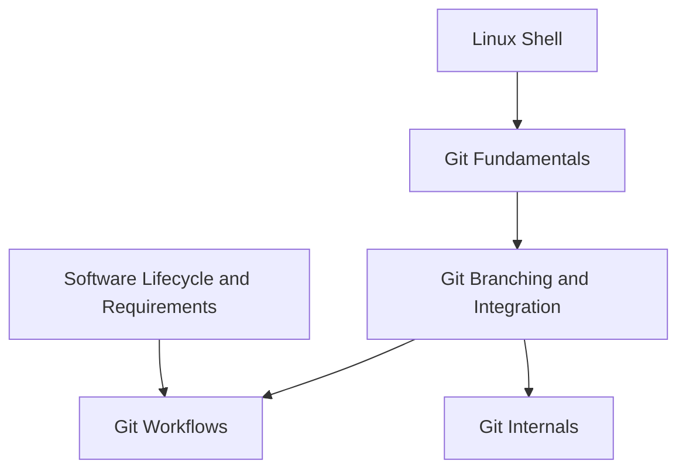

# Git and Version Control

<!-- Generated map: edit curriculum.yaml, then run scripts/curriculum.py build. -->

[Master curriculum](../CURRICULUM.md) · [Model and editing guide](../CONTRIBUTING.md)

## Purpose

Understand history, collaboration, and reproducible source changes.

## Prerequisites

[[03-linux/README#Linux Shell|Linux Shell]] · [Linux Shell](../03-linux/README.md#linux-shell)

These orient entry into the domain; each topic below has its own requirements. They are not inherited gates.

## Recommended Learning Order

This is one dependency-compatible reading order. External prerequisites can be learned in parallel; numbering is guidance, not a completion checklist.

1. [Git Fundamentals](README.md#git-fundamentals)
2. [Git Branching and Integration](README.md#git-branching)
3. [Git Workflows](README.md#git-workflows)
4. [Git Internals](README.md#git-internals)

## Major Areas

### History and Collaboration

#### Git Fundamentals

**Concepts:** Working tree; Index; Commits; Remote repositories; Tags.

**Prerequisites:** [[03-linux/README#Linux Shell|Linux Shell]] · [Linux Shell](../03-linux/README.md#linux-shell)

#### Git Branching and Integration

**Concepts:** Branches; Merge; Rebase; Cherry-pick; Merge conflicts.

**Prerequisites:** [[07-git/README#Git Fundamentals|Git Fundamentals]] · [Git Fundamentals](README.md#git-fundamentals)

#### Git Workflows

**Concepts:** Pull requests; Reviews; Trunk-based development; Release branches.

**Prerequisites:** [[07-git/README#Git Branching and Integration|Git Branching and Integration]] · [Git Branching and Integration](README.md#git-branching); [[06-software-engineering/README#Software Lifecycle and Requirements|Software Lifecycle and Requirements]] · [Software Lifecycle and Requirements](../06-software-engineering/README.md#software-lifecycle)

### Internals

#### Git Internals

**Concepts:** Objects; Trees; Refs; Commit DAG; Reflog.

**Prerequisites:** [[07-git/README#Git Branching and Integration|Git Branching and Integration]] · [Git Branching and Integration](README.md#git-branching)

## Dependency Sketch

Selected direct prerequisite edges, not the entire domain graph. Arrows mean “learn before”.

## Leads To

[[12-infrastructure-as-code/README#Infrastructure as Code Principles|Infrastructure as Code Principles]] · [Infrastructure as Code Principles](../12-infrastructure-as-code/README.md#infrastructure-as-code-principles); [[15-ci-cd/README#Continuous Integration|Continuous Integration]] · [Continuous Integration](../15-ci-cd/README.md#ci-fundamentals); [[16-gitops/README#GitOps Principles|GitOps Principles]] · [GitOps Principles](../16-gitops/README.md#gitops-principles)
