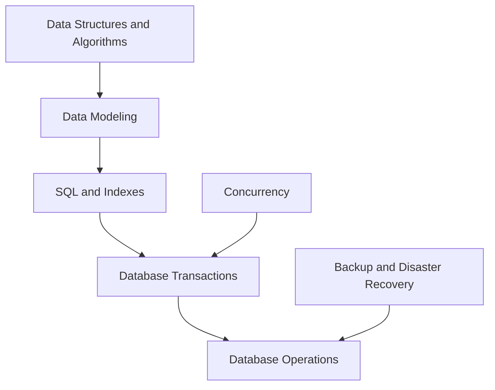

# Databases and Data

<!-- Generated map: edit curriculum.yaml, then run scripts/curriculum.py build. -->

[Master curriculum](../CURRICULUM.md) · [Model and editing guide](../CONTRIBUTING.md)

## Purpose

Model, persist, query, and recover data with explicit integrity guarantees.

## Prerequisites

[[00-foundations/README#Data Structures and Algorithms|Data Structures and Algorithms]] · [Data Structures and Algorithms](../00-foundations/README.md#data-structures-algorithms)

These orient entry into the domain; each topic below has its own requirements. They are not inherited gates.

## Recommended Learning Order

This is one dependency-compatible reading order. External prerequisites can be learned in parallel; numbering is guidance, not a completion checklist.

1. [Data Modeling](README.md#data-modeling)
2. [SQL and Indexes](README.md#sql-indexes)
3. [Database Transactions](README.md#database-transactions)
4. [Database Operations](README.md#database-operations)

## Major Areas

### Models and Queries

#### Data Modeling

**Concepts:** Entities; Relationships; Keys; Relational and document models.

**Prerequisites:** [[00-foundations/README#Data Structures and Algorithms|Data Structures and Algorithms]] · [Data Structures and Algorithms](../00-foundations/README.md#data-structures-algorithms)

#### SQL and Indexes

**Concepts:** Queries; Joins; Index structures; Query plans.

**Prerequisites:** [[08-databases/README#Data Modeling|Data Modeling]] · [Data Modeling](README.md#data-modeling)

### Integrity and Operations

#### Database Transactions

**Concepts:** ACID; Isolation; Locking; MVCC.

**Prerequisites:** [[08-databases/README#SQL and Indexes|SQL and Indexes]] · [SQL and Indexes](README.md#sql-indexes); [[02-operating-systems/README#Concurrency|Concurrency]] · [Concurrency](../02-operating-systems/README.md#concurrency)

#### Database Operations

**Concepts:** Migrations; Connection pools; Backup consistency; Restore verification.

**Prerequisites:** [[08-databases/README#Database Transactions|Database Transactions]] · [Database Transactions](README.md#database-transactions); [[22-production-operations/README#Backup and Disaster Recovery|Backup and Disaster Recovery]] · [Backup and Disaster Recovery](../22-production-operations/README.md#backup-recovery)

## Dependency Sketch

Selected direct prerequisite edges, not the entire domain graph. Arrows mean “learn before”.

## Leads To

[[11-aws/README#AWS Data Services|AWS Data Services]] · [AWS Data Services](../11-aws/README.md#aws-data); [[19-distributed-systems/README#Distributed Systems Fundamentals|Distributed Systems Fundamentals]] · [Distributed Systems Fundamentals](../19-distributed-systems/README.md#distributed-fundamentals); [[19-distributed-systems/README#Partitioning and Sharding|Partitioning and Sharding]] · [Partitioning and Sharding](../19-distributed-systems/README.md#partitioning-sharding); [[19-distributed-systems/README#Distributed Transactions|Distributed Transactions]] · [Distributed Transactions](../19-distributed-systems/README.md#distributed-transactions); [[21-system-design/README#System Design Method|System Design Method]] · [System Design Method](../21-system-design/README.md#system-design-method)
