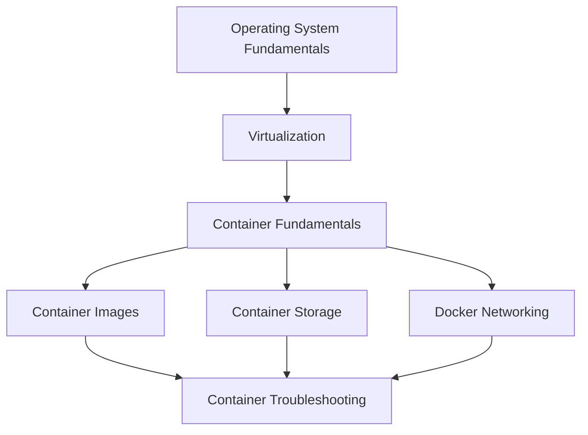

# Virtualization and Containers

<!-- Generated map: edit curriculum.yaml, then run scripts/curriculum.py build. -->

[Master curriculum](../CURRICULUM.md) · [Model and editing guide](../CONTRIBUTING.md)

## Purpose

Understand workload isolation, image distribution, and container runtime behavior.

## Prerequisites

[[02-operating-systems/README#Operating System Fundamentals|Operating System Fundamentals]] · [Operating System Fundamentals](../02-operating-systems/README.md#os-fundamentals)

These orient entry into the domain; each topic below has its own requirements. They are not inherited gates.

## Recommended Learning Order

This is one dependency-compatible reading order. External prerequisites can be learned in parallel; numbering is guidance, not a completion checklist.

1. [Virtualization](README.md#virtualization)
2. [Container Fundamentals](README.md#container-fundamentals)
3. [Container Images](README.md#container-images)
4. [Container Storage](README.md#container-storage)
5. [Docker Networking](README.md#docker-networking)
6. [Container Troubleshooting](README.md#container-troubleshooting)

## Major Areas

### Isolation and Runtime

#### Virtualization

**Concepts:** Hypervisors; Virtual machines; Guest kernels.

**Prerequisites:** [[02-operating-systems/README#Operating System Fundamentals|Operating System Fundamentals]] · [Operating System Fundamentals](../02-operating-systems/README.md#os-fundamentals)

#### Container Fundamentals

**Concepts:** Namespaces; cgroups; Shared kernel; OCI; Docker; Container runtimes.

**Prerequisites:** [[03-linux/README#Linux Processes|Linux Processes]] · [Linux Processes](../03-linux/README.md#linux-processes); [[02-operating-systems/README#Memory Management|Memory Management]] · [Memory Management](../02-operating-systems/README.md#memory-management); [[09-containers/README#Virtualization|Virtualization]] · [Virtualization](README.md#virtualization)

### Images and Runtime Resources

#### Container Images

**Concepts:** Layers; Dockerfile; ENTRYPOINT; CMD; Multi-stage builds; Registries.

**Prerequisites:** [[09-containers/README#Container Fundamentals|Container Fundamentals]] · [Container Fundamentals](README.md#container-fundamentals); [[05-programming/README#Program Dependencies and Packaging|Program Dependencies and Packaging]] · [Program Dependencies and Packaging](../05-programming/README.md#program-dependencies)

#### Container Storage

**Concepts:** Writable layers; Bind mounts; Volumes; Persistence.

**Prerequisites:** [[09-containers/README#Container Fundamentals|Container Fundamentals]] · [Container Fundamentals](README.md#container-fundamentals); [[03-linux/README#Linux Filesystem|Linux Filesystem]] · [Linux Filesystem](../03-linux/README.md#linux-filesystem)

#### Docker Networking

**Concepts:** Network namespaces; Bridges; Port publishing; Embedded DNS.

**Prerequisites:** [[09-containers/README#Container Fundamentals|Container Fundamentals]] · [Container Fundamentals](README.md#container-fundamentals); [[03-linux/README#Linux Networking|Linux Networking]] · [Linux Networking](../03-linux/README.md#linux-networking); [[04-networking/README#NAT|NAT]] · [NAT](../04-networking/README.md#nat)

**Implements / applies:** [[04-networking/README#Routing|Routing]] · [Routing](../04-networking/README.md#routing); [[04-networking/README#NAT|NAT]] · [NAT](../04-networking/README.md#nat); [[04-networking/dns|DNS]] · [DNS](../04-networking/dns.md)

#### Container Troubleshooting

**Concepts:** Exit codes; Resource limits; Image failures; Connectivity failures.

**Prerequisites:** [[09-containers/README#Container Images|Container Images]] · [Container Images](README.md#container-images); [[09-containers/README#Container Storage|Container Storage]] · [Container Storage](README.md#container-storage); [[09-containers/README#Docker Networking|Docker Networking]] · [Docker Networking](README.md#docker-networking)

## Dependency Sketch

Selected direct prerequisite edges, not the entire domain graph. Arrows mean “learn before”.

## Leads To

[[10-cloud/README#Cloud Fundamentals|Cloud Fundamentals]] · [Cloud Fundamentals](../10-cloud/README.md#cloud-fundamentals); [[11-aws/README#AWS Compute|AWS Compute]] · [AWS Compute](../11-aws/README.md#aws-compute); [[11-aws/README#AWS Managed Container Deployment|AWS Managed Container Deployment]] · [AWS Managed Container Deployment](../11-aws/README.md#aws-managed-containers); [[14-kubernetes/README#Kubernetes Architecture|Kubernetes Architecture]] · [Kubernetes Architecture](../14-kubernetes/README.md#kubernetes-architecture); [[14-kubernetes/README#Kubernetes Pods and Workloads|Kubernetes Pods and Workloads]] · [Kubernetes Pods and Workloads](../14-kubernetes/README.md#kubernetes-pods); [[14-kubernetes/README#Kubernetes Storage|Kubernetes Storage]] · [Kubernetes Storage](../14-kubernetes/README.md#kubernetes-storage); [[15-ci-cd/README#Artifact Management|Artifact Management]] · [Artifact Management](../15-ci-cd/README.md#artifact-management); [[18-security/README#Container Security|Container Security]] · [Container Security](../18-security/README.md#container-security)

## Reference Roadmaps

Use these for coverage and further exploration; the prerequisite relationships here are curated independently.

- [roadmap.sh — DevOps](https://roadmap.sh/devops)

[Reference review and scope decisions](../references/roadmap-sh.md)
