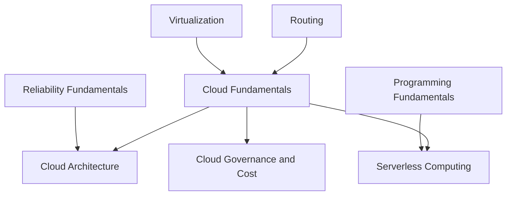

# Cloud Computing

<!-- Generated map: edit curriculum.yaml, then run scripts/curriculum.py build. -->

[Master curriculum](../CURRICULUM.md) · [Model and editing guide](../CONTRIBUTING.md)

## Purpose

Understand cloud service models, failure boundaries, and resource economics.

## Prerequisites

[[09-containers/README#Virtualization|Virtualization]] · [Virtualization](../09-containers/README.md#virtualization); [[04-networking/README#Routing|Routing]] · [Routing](../04-networking/README.md#routing)

These orient entry into the domain; each topic below has its own requirements. They are not inherited gates.

## Recommended Learning Order

This is one dependency-compatible reading order. External prerequisites can be learned in parallel; numbering is guidance, not a completion checklist.

1. [Cloud Fundamentals](README.md#cloud-fundamentals)
2. [Serverless Computing](README.md#serverless-computing)
3. [Cloud Governance and Cost](README.md#cloud-governance)
4. [Cloud Architecture](README.md#cloud-architecture)

## Major Areas

### Service and Resource Models

#### Cloud Fundamentals

**Concepts:** Service models; Regions; Availability zones; Shared responsibility; Compute; Storage; Networking; Managed databases.

**Prerequisites:** [[09-containers/README#Virtualization|Virtualization]] · [Virtualization](../09-containers/README.md#virtualization); [[04-networking/README#Routing|Routing]] · [Routing](../04-networking/README.md#routing)

#### Cloud Architecture

**Concepts:** Scalability; High availability; Failure domains; Managed services; Architecture review; Well-Architected tradeoffs.

**Prerequisites:** [[10-cloud/README#Cloud Fundamentals|Cloud Fundamentals]] · [Cloud Fundamentals](README.md#cloud-fundamentals); [[20-sre/README#Reliability Fundamentals|Reliability Fundamentals]] · [Reliability Fundamentals](../20-sre/README.md#reliability-fundamentals)

#### Serverless Computing

**Concepts:** Managed execution; Event triggers; Cold starts; Concurrency limits; Execution constraints; Operational ownership.

**Prerequisites:** [[10-cloud/README#Cloud Fundamentals|Cloud Fundamentals]] · [Cloud Fundamentals](README.md#cloud-fundamentals); [[00-foundations/README#Programming Fundamentals|Programming Fundamentals]] · [Programming Fundamentals](../00-foundations/README.md#programming-fundamentals)

**Related:** [[19-distributed-systems/README#Messaging and Event-Driven Architecture|Messaging and Event-Driven Architecture]] · [Messaging and Event-Driven Architecture](../19-distributed-systems/README.md#messaging); [[19-distributed-systems/README#Resilient Communication|Resilient Communication]] · [Resilient Communication](../19-distributed-systems/README.md#resilient-communication)

### Governance and Economics

#### Cloud Governance and Cost

**Concepts:** Account boundaries; IAM application; Metering; Cost allocation; Budgets; Cloud security.

**Prerequisites:** [[10-cloud/README#Cloud Fundamentals|Cloud Fundamentals]] · [Cloud Fundamentals](README.md#cloud-fundamentals); [[18-security/identity-access|Identity and Access Management]] · [Identity and Access Management](../18-security/identity-access.md)

## Dependency Sketch

Selected direct prerequisite edges, not the entire domain graph. Arrows mean “learn before”.

## Leads To

[[11-aws/README#AWS IAM and Organizations|AWS IAM and Organizations]] · [AWS IAM and Organizations](../11-aws/README.md#aws-iam); [[11-aws/README#AWS VPC|AWS VPC]] · [AWS VPC](../11-aws/README.md#aws-vpc); [[11-aws/README#AWS Data Services|AWS Data Services]] · [AWS Data Services](../11-aws/README.md#aws-data); [[11-aws/README#AWS Messaging|AWS Messaging]] · [AWS Messaging](../11-aws/README.md#aws-messaging); [[11-aws/README#AWS Serverless and Edge Delivery|AWS Serverless and Edge Delivery]] · [AWS Serverless and Edge Delivery](../11-aws/README.md#aws-serverless-edge); [[12-infrastructure-as-code/README#Infrastructure as Code Principles|Infrastructure as Code Principles]] · [Infrastructure as Code Principles](../12-infrastructure-as-code/README.md#infrastructure-as-code-principles)

## Reference Roadmaps

Use these for coverage and further exploration; the prerequisite relationships here are curated independently.

- [roadmap.sh — AWS](https://roadmap.sh/aws)
- [roadmap.sh — DevOps](https://roadmap.sh/devops)

[Reference review and scope decisions](../references/roadmap-sh.md)
