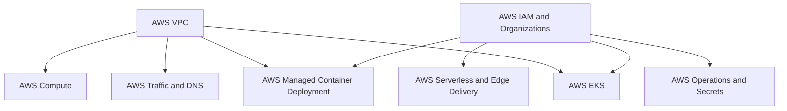

# AWS

<!-- Generated map: edit curriculum.yaml, then run scripts/curriculum.py build. -->

[Master curriculum](../CURRICULUM.md) · [Model and editing guide](../CONTRIBUTING.md)

## Purpose

Map transferable cloud concepts onto AWS service boundaries and operational choices.

## Prerequisites

[[10-cloud/README#Cloud Governance and Cost|Cloud Governance and Cost]] · [Cloud Governance and Cost](../10-cloud/README.md#cloud-governance); [[18-security/identity-access|Identity and Access Management]] · [Identity and Access Management](../18-security/identity-access.md)

These orient entry into the domain; each topic below has its own requirements. They are not inherited gates.

## Recommended Learning Order

This is one dependency-compatible reading order. External prerequisites can be learned in parallel; numbering is guidance, not a completion checklist.

1. [AWS Data Services](README.md#aws-data)
2. [AWS IAM and Organizations](README.md#aws-iam)
3. [AWS Operations and Secrets](README.md#aws-operations)
4. [AWS VPC](README.md#aws-vpc)
5. [AWS Compute](README.md#aws-compute)
6. [AWS Traffic and DNS](README.md#aws-traffic)
7. [AWS Managed Container Deployment](README.md#aws-managed-containers)
8. [AWS Messaging](README.md#aws-messaging)
9. [AWS Serverless and Edge Delivery](README.md#aws-serverless-edge)
10. [AWS EKS](README.md#aws-eks)

## Major Areas

### Identity and Network Foundation

#### AWS IAM and Organizations

**Concepts:** Policies; Roles; Federation; Organizations; Service control policies.

**Prerequisites:** [[10-cloud/README#Cloud Governance and Cost|Cloud Governance and Cost]] · [Cloud Governance and Cost](../10-cloud/README.md#cloud-governance); [[18-security/identity-access|Identity and Access Management]] · [Identity and Access Management](../18-security/identity-access.md)

**Implements / applies:** [[18-security/identity-access|Identity and Access Management]] · [Identity and Access Management](../18-security/identity-access.md)

#### AWS VPC

**Concepts:** Subnets; Route tables; Internet Gateway; NAT Gateway; Security Groups; NACLs.

**Prerequisites:** [[10-cloud/README#Cloud Fundamentals|Cloud Fundamentals]] · [Cloud Fundamentals](../10-cloud/README.md#cloud-fundamentals); [[04-networking/subnetting|Subnetting]] · [Subnetting](../04-networking/subnetting.md); [[04-networking/README#Routing|Routing]] · [Routing](../04-networking/README.md#routing); [[04-networking/README#NAT|NAT]] · [NAT](../04-networking/README.md#nat); [[18-security/README#Network Security|Network Security]] · [Network Security](../18-security/README.md#network-security)

**Implements / applies:** [[04-networking/README#Routing|Routing]] · [Routing](../04-networking/README.md#routing); [[04-networking/subnetting|Subnetting]] · [Subnetting](../04-networking/subnetting.md); [[18-security/README#Network Security|Network Security]] · [Network Security](../18-security/README.md#network-security)

### Compute Data and Traffic

#### AWS Compute

**Concepts:** EC2; AMIs; EBS; Auto Scaling; Lambda; Quotas; Instance purchase models; User data; Launch templates.

**Prerequisites:** [[11-aws/README#AWS VPC|AWS VPC]] · [AWS VPC](README.md#aws-vpc); [[09-containers/README#Container Fundamentals|Container Fundamentals]] · [Container Fundamentals](../09-containers/README.md#container-fundamentals)

**Related:** [[10-cloud/README#Serverless Computing|Serverless Computing]] · [Serverless Computing](../10-cloud/README.md#serverless-computing); [[11-aws/README#AWS Serverless and Edge Delivery|AWS Serverless and Edge Delivery]] · [AWS Serverless and Edge Delivery](README.md#aws-serverless-edge); [[11-aws/README#AWS Managed Container Deployment|AWS Managed Container Deployment]] · [AWS Managed Container Deployment](README.md#aws-managed-containers)

#### AWS Data Services

**Concepts:** S3; RDS; DynamoDB; Durability; Access patterns; S3 lifecycle; Storage classes; DynamoDB indexes; ElastiCache.

**Prerequisites:** [[10-cloud/README#Cloud Fundamentals|Cloud Fundamentals]] · [Cloud Fundamentals](../10-cloud/README.md#cloud-fundamentals); [[08-databases/README#Data Modeling|Data Modeling]] · [Data Modeling](../08-databases/README.md#data-modeling); [[08-databases/README#Database Transactions|Database Transactions]] · [Database Transactions](../08-databases/README.md#database-transactions)

**Implements / applies:** [[08-databases/README#Data Modeling|Data Modeling]] · [Data Modeling](../08-databases/README.md#data-modeling); [[21-system-design/README#Caching|Caching]] · [Caching](../21-system-design/README.md#caching)

#### AWS Traffic and DNS

**Concepts:** ALB; NLB; Route 53; Routing policies.

**Prerequisites:** [[11-aws/README#AWS VPC|AWS VPC]] · [AWS VPC](README.md#aws-vpc); [[04-networking/README#Proxies and Load Balancing|Proxies and Load Balancing]] · [Proxies and Load Balancing](../04-networking/README.md#proxies-load-balancing); [[04-networking/dns|DNS]] · [DNS](../04-networking/dns.md)

**Implements / applies:** [[04-networking/dns|DNS]] · [DNS](../04-networking/dns.md); [[04-networking/README#Proxies and Load Balancing|Proxies and Load Balancing]] · [Proxies and Load Balancing](../04-networking/README.md#proxies-load-balancing)

#### AWS Messaging

**Concepts:** SQS; SNS; Delivery semantics; Dead-letter queues.

**Prerequisites:** [[19-distributed-systems/README#Messaging and Event-Driven Architecture|Messaging and Event-Driven Architecture]] · [Messaging and Event-Driven Architecture](../19-distributed-systems/README.md#messaging); [[10-cloud/README#Cloud Fundamentals|Cloud Fundamentals]] · [Cloud Fundamentals](../10-cloud/README.md#cloud-fundamentals)

**Implements / applies:** [[19-distributed-systems/README#Messaging and Event-Driven Architecture|Messaging and Event-Driven Architecture]] · [Messaging and Event-Driven Architecture](../19-distributed-systems/README.md#messaging)

#### AWS Managed Container Deployment

**Concepts:** ECR; ECS; Task definitions; Services; Fargate; Capacity and access boundaries.

**Prerequisites:** [[09-containers/README#Container Images|Container Images]] · [Container Images](../09-containers/README.md#container-images); [[11-aws/README#AWS VPC|AWS VPC]] · [AWS VPC](README.md#aws-vpc); [[11-aws/README#AWS IAM and Organizations|AWS IAM and Organizations]] · [AWS IAM and Organizations](README.md#aws-iam)

**Implements / applies:** [[09-containers/README#Container Fundamentals|Container Fundamentals]] · [Container Fundamentals](../09-containers/README.md#container-fundamentals); [[15-ci-cd/README#Artifact Management|Artifact Management]] · [Artifact Management](../15-ci-cd/README.md#artifact-management)

#### AWS Serverless and Edge Delivery

**Concepts:** Lambda; API Gateway; EventBridge; CloudFront; Origin access; Cache invalidation.

**Prerequisites:** [[10-cloud/README#Serverless Computing|Serverless Computing]] · [Serverless Computing](../10-cloud/README.md#serverless-computing); [[21-system-design/README#Content Delivery and Edge Caching|Content Delivery and Edge Caching]] · [Content Delivery and Edge Caching](../21-system-design/README.md#content-delivery); [[11-aws/README#AWS IAM and Organizations|AWS IAM and Organizations]] · [AWS IAM and Organizations](README.md#aws-iam); [[19-distributed-systems/README#Messaging and Event-Driven Architecture|Messaging and Event-Driven Architecture]] · [Messaging and Event-Driven Architecture](../19-distributed-systems/README.md#messaging)

**Implements / applies:** [[10-cloud/README#Serverless Computing|Serverless Computing]] · [Serverless Computing](../10-cloud/README.md#serverless-computing); [[21-system-design/README#Content Delivery and Edge Caching|Content Delivery and Edge Caching]] · [Content Delivery and Edge Caching](../21-system-design/README.md#content-delivery); [[19-distributed-systems/README#Messaging and Event-Driven Architecture|Messaging and Event-Driven Architecture]] · [Messaging and Event-Driven Architecture](../19-distributed-systems/README.md#messaging)

### Operations and Managed Kubernetes

#### AWS Operations and Secrets

**Concepts:** CloudWatch; CloudTrail; Secrets Manager; KMS.

**Prerequisites:** [[11-aws/README#AWS IAM and Organizations|AWS IAM and Organizations]] · [AWS IAM and Organizations](README.md#aws-iam); [[17-observability/README#Telemetry and Observability|Telemetry and Observability]] · [Telemetry and Observability](../17-observability/README.md#telemetry); [[18-security/README#Secrets and Key Management|Secrets and Key Management]] · [Secrets and Key Management](../18-security/README.md#secrets-key-management)

**Implements / applies:** [[17-observability/README#Telemetry and Observability|Telemetry and Observability]] · [Telemetry and Observability](../17-observability/README.md#telemetry); [[18-security/README#Secrets and Key Management|Secrets and Key Management]] · [Secrets and Key Management](../18-security/README.md#secrets-key-management)

#### AWS EKS

**Concepts:** Managed control plane; Worker nodes; Network integration; Access; Upgrades.

**Prerequisites:** [[14-kubernetes/README#Kubernetes Cluster Architecture and Operations|Kubernetes Cluster Architecture and Operations]] · [Kubernetes Cluster Architecture and Operations](../14-kubernetes/README.md#kubernetes-cluster-operations); [[11-aws/README#AWS VPC|AWS VPC]] · [AWS VPC](README.md#aws-vpc); [[11-aws/README#AWS IAM and Organizations|AWS IAM and Organizations]] · [AWS IAM and Organizations](README.md#aws-iam)

## Dependency Sketch

Selected direct prerequisite edges, not the entire domain graph. Arrows mean “learn before”.

## Leads To

Specialize further according to real systems and learning needs.

## Reference Roadmaps

Use these for coverage and further exploration; the prerequisite relationships here are curated independently.

- [roadmap.sh — AWS](https://roadmap.sh/aws)

[Reference review and scope decisions](../references/roadmap-sh.md)
