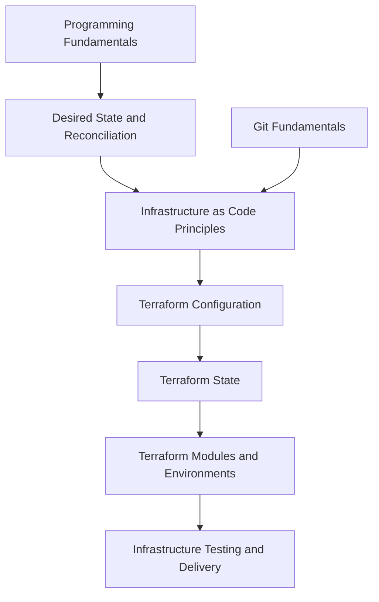

# Infrastructure as Code

<!-- Generated map: edit curriculum.yaml, then run scripts/curriculum.py build. -->

[Master curriculum](../CURRICULUM.md) · [Model and editing guide](../CONTRIBUTING.md)

## Purpose

Describe desired infrastructure and manage changes, state, dependencies, and drift.

## Prerequisites

[[00-foundations/README#Programming Fundamentals|Programming Fundamentals]] · [Programming Fundamentals](../00-foundations/README.md#programming-fundamentals)

These orient entry into the domain; each topic below has its own requirements. They are not inherited gates.

## Recommended Learning Order

This is one dependency-compatible reading order. External prerequisites can be learned in parallel; numbering is guidance, not a completion checklist.

1. [Desired State and Reconciliation](README.md#desired-state)
2. [Infrastructure as Code Principles](README.md#infrastructure-as-code-principles)
3. [Terraform Configuration](README.md#terraform-configuration)
4. [Terraform State](terraform-state.md)
5. [Terraform Modules and Environments](README.md#terraform-modules)
6. [Infrastructure Testing and Delivery](README.md#infrastructure-testing)

## Major Areas

### Conceptual Foundations

#### Desired State and Reconciliation

**Concepts:** Declarative configuration; Observed state; Reconciliation; Drift.

**Prerequisites:** [[00-foundations/README#Programming Fundamentals|Programming Fundamentals]] · [Programming Fundamentals](../00-foundations/README.md#programming-fundamentals)

**Related:** [[16-gitops/README#GitOps Principles|GitOps Principles]] · [GitOps Principles](../16-gitops/README.md#gitops-principles)

#### Infrastructure as Code Principles

**Concepts:** Resource graph; Planning; Change review; Lifecycle; Infrastructure ownership; CloudFormation; Pulumi; AWS CDK.

**Prerequisites:** [[12-infrastructure-as-code/README#Desired State and Reconciliation|Desired State and Reconciliation]] · [Desired State and Reconciliation](README.md#desired-state); [[19-distributed-systems/README#Idempotency|Idempotency]] · [Idempotency](../19-distributed-systems/README.md#idempotency); [[10-cloud/README#Cloud Fundamentals|Cloud Fundamentals]] · [Cloud Fundamentals](../10-cloud/README.md#cloud-fundamentals); [[07-git/README#Git Fundamentals|Git Fundamentals]] · [Git Fundamentals](../07-git/README.md#git-fundamentals)

### Terraform Implementation

#### Terraform Configuration

**Concepts:** Providers; Resources; Data sources; Variables; Outputs; Locals; Dependency graph; Lifecycle.

**Prerequisites:** [[12-infrastructure-as-code/README#Infrastructure as Code Principles|Infrastructure as Code Principles]] · [Infrastructure as Code Principles](README.md#infrastructure-as-code-principles)

**Implements / applies:** [[12-infrastructure-as-code/README#Infrastructure as Code Principles|Infrastructure as Code Principles]] · [Infrastructure as Code Principles](README.md#infrastructure-as-code-principles); [[12-infrastructure-as-code/README#Desired State and Reconciliation|Desired State and Reconciliation]] · [Desired State and Reconciliation](README.md#desired-state)

#### Terraform State

**Concepts:** Resource bindings; Remote state; State locking; Import; Drift; Sensitive data.

**Prerequisites:** [[12-infrastructure-as-code/README#Terraform Configuration|Terraform Configuration]] · [Terraform Configuration](README.md#terraform-configuration)

**Topic note:** [[12-infrastructure-as-code/terraform-state|Terraform State]] · [Terraform State](terraform-state.md)

**Implements / applies:** [[12-infrastructure-as-code/README#Desired State and Reconciliation|Desired State and Reconciliation]] · [Desired State and Reconciliation](README.md#desired-state)

**Related:** [[12-infrastructure-as-code/README#Desired State and Reconciliation|Desired State and Reconciliation]] · [Desired State and Reconciliation](README.md#desired-state); [[18-security/README#Secrets and Key Management|Secrets and Key Management]] · [Secrets and Key Management](../18-security/README.md#secrets-key-management)

#### Terraform Modules and Environments

**Concepts:** Modules; Contracts; Workspaces; Environment isolation.

**Prerequisites:** [[12-infrastructure-as-code/terraform-state|Terraform State]] · [Terraform State](terraform-state.md)

#### Infrastructure Testing and Delivery

**Concepts:** Validation; Plan review; Policy; Terraform CI/CD; Integration testing.

**Prerequisites:** [[12-infrastructure-as-code/README#Terraform Modules and Environments|Terraform Modules and Environments]] · [Terraform Modules and Environments](README.md#terraform-modules); [[06-software-engineering/README#Software Testing|Software Testing]] · [Software Testing](../06-software-engineering/README.md#software-testing); [[15-ci-cd/README#Continuous Integration|Continuous Integration]] · [Continuous Integration](../15-ci-cd/README.md#ci-fundamentals)

## Dependency Sketch

Selected direct prerequisite edges, not the entire domain graph. Arrows mean “learn before”.

## Leads To

[[13-configuration-management/README#Configuration Management Principles|Configuration Management Principles]] · [Configuration Management Principles](../13-configuration-management/README.md#configuration-management-principles); [[14-kubernetes/README#Kubernetes Architecture|Kubernetes Architecture]] · [Kubernetes Architecture](../14-kubernetes/README.md#kubernetes-architecture); [[16-gitops/README#GitOps Principles|GitOps Principles]] · [GitOps Principles](../16-gitops/README.md#gitops-principles); [[18-security/README#Policy as Code|Policy as Code]] · [Policy as Code](../18-security/README.md#policy-as-code); [[23-advanced/README#Platform Engineering|Platform Engineering]] · [Platform Engineering](../23-advanced/README.md#platform-engineering)

## Reference Roadmaps

Use these for coverage and further exploration; the prerequisite relationships here are curated independently.

- [roadmap.sh — DevOps](https://roadmap.sh/devops)

[Reference review and scope decisions](../references/roadmap-sh.md)
