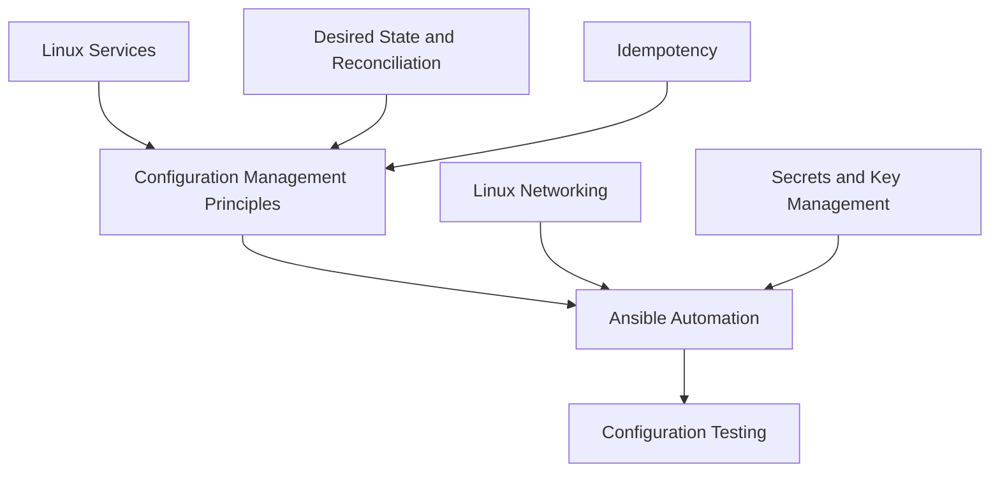

# Configuration Management

<!-- Generated map: edit curriculum.yaml, then run scripts/curriculum.py build. -->

[Master curriculum](../CURRICULUM.md) · [Model and editing guide](../CONTRIBUTING.md)

## Purpose

Converge host configuration through repeatable, testable automation.

## Prerequisites

[[12-infrastructure-as-code/README#Desired State and Reconciliation|Desired State and Reconciliation]] · [Desired State and Reconciliation](../12-infrastructure-as-code/README.md#desired-state); [[19-distributed-systems/README#Idempotency|Idempotency]] · [Idempotency](../19-distributed-systems/README.md#idempotency); [[03-linux/README#Linux Services|Linux Services]] · [Linux Services](../03-linux/README.md#linux-services)

These orient entry into the domain; each topic below has its own requirements. They are not inherited gates.

## Recommended Learning Order

This is one dependency-compatible reading order. External prerequisites can be learned in parallel; numbering is guidance, not a completion checklist.

1. [Configuration Management Principles](README.md#configuration-management-principles)
2. [Ansible Automation](README.md#ansible-automation)
3. [Configuration Testing](README.md#configuration-testing)

## Major Areas

### Configuration Concepts

#### Configuration Management Principles

**Concepts:** Host configuration; Convergence; Inventory; Configuration drift.

**Prerequisites:** [[12-infrastructure-as-code/README#Desired State and Reconciliation|Desired State and Reconciliation]] · [Desired State and Reconciliation](../12-infrastructure-as-code/README.md#desired-state); [[19-distributed-systems/README#Idempotency|Idempotency]] · [Idempotency](../19-distributed-systems/README.md#idempotency); [[03-linux/README#Linux Services|Linux Services]] · [Linux Services](../03-linux/README.md#linux-services)

### Ansible Implementation

#### Ansible Automation

**Concepts:** Inventory; Playbooks; Variables; Roles; Templates; Handlers; Secrets; Ansible automation.

**Prerequisites:** [[13-configuration-management/README#Configuration Management Principles|Configuration Management Principles]] · [Configuration Management Principles](README.md#configuration-management-principles); [[03-linux/README#Linux Networking|Linux Networking]] · [Linux Networking](../03-linux/README.md#linux-networking); [[18-security/README#Secrets and Key Management|Secrets and Key Management]] · [Secrets and Key Management](../18-security/README.md#secrets-key-management)

**Implements / applies:** [[13-configuration-management/README#Configuration Management Principles|Configuration Management Principles]] · [Configuration Management Principles](README.md#configuration-management-principles); [[19-distributed-systems/README#Idempotency|Idempotency]] · [Idempotency](../19-distributed-systems/README.md#idempotency)

#### Configuration Testing

**Concepts:** Molecule; Idempotence tests; Check mode limitations; Integration environments.

**Prerequisites:** [[13-configuration-management/README#Ansible Automation|Ansible Automation]] · [Ansible Automation](README.md#ansible-automation); [[06-software-engineering/README#Software Testing|Software Testing]] · [Software Testing](../06-software-engineering/README.md#software-testing)

## Dependency Sketch

Selected direct prerequisite edges, not the entire domain graph. Arrows mean “learn before”.

## Leads To

[[04-networking/README#Network Automation|Network Automation]] · [Network Automation](../04-networking/README.md#network-automation)

## Reference Roadmaps

Use these for coverage and further exploration; the prerequisite relationships here are curated independently.

- [roadmap.sh — DevOps](https://roadmap.sh/devops)

[Reference review and scope decisions](../references/roadmap-sh.md)
