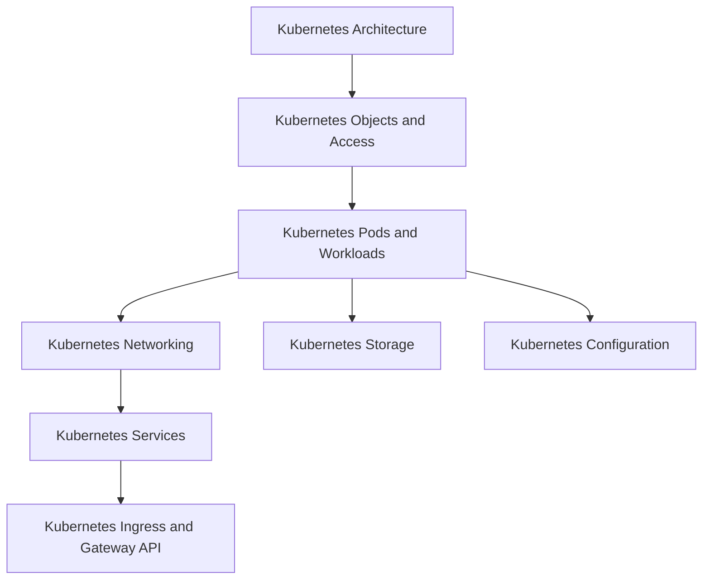

# Kubernetes and Container Orchestration

<!-- Generated map: edit curriculum.yaml, then run scripts/curriculum.py build. -->

[Master curriculum](../CURRICULUM.md) · [Model and editing guide](../CONTRIBUTING.md)

## Purpose

Understand orchestration through the API, reconciliation, workload resources, and cluster operations.

## Prerequisites

[[09-containers/README#Container Fundamentals|Container Fundamentals]] · [Container Fundamentals](../09-containers/README.md#container-fundamentals); [[12-infrastructure-as-code/README#Desired State and Reconciliation|Desired State and Reconciliation]] · [Desired State and Reconciliation](../12-infrastructure-as-code/README.md#desired-state); [[09-containers/README#Docker Networking|Docker Networking]] · [Docker Networking](../09-containers/README.md#docker-networking)

These orient entry into the domain; each topic below has its own requirements. They are not inherited gates.

## Recommended Learning Order

This is one dependency-compatible reading order. External prerequisites can be learned in parallel; numbering is guidance, not a completion checklist.

1. [Kubernetes Architecture](README.md#kubernetes-architecture)
2. [Kubernetes Objects and Access](README.md#kubernetes-objects)
3. [Kubernetes Pods and Workloads](README.md#kubernetes-pods)
4. [Kubernetes Networking](README.md#kubernetes-networking)
5. [Kubernetes Storage](README.md#kubernetes-storage)
6. [Kubernetes Scheduling and Resources](README.md#kubernetes-scheduling)
7. [Kubernetes Extensions](README.md#kubernetes-extensions)
8. [Kubernetes Services](kubernetes-services.md)
9. [Kubernetes Ingress and Gateway API](README.md#kubernetes-ingress)
10. [Kubernetes Troubleshooting](README.md#kubernetes-troubleshooting)
11. [Kubernetes Configuration](README.md#kubernetes-configuration)
12. [Kubernetes Security](README.md#kubernetes-security)
13. [Kubernetes Cluster Architecture and Operations](README.md#kubernetes-cluster-operations)

## Major Areas

### Fundamentals Architecture and Objects

#### Kubernetes Architecture

**Concepts:** Orchestration; Control plane; API server; etcd; Scheduler; Controller manager; kubelet; kube-proxy.

**Prerequisites:** [[09-containers/README#Container Fundamentals|Container Fundamentals]] · [Container Fundamentals](../09-containers/README.md#container-fundamentals); [[12-infrastructure-as-code/README#Desired State and Reconciliation|Desired State and Reconciliation]] · [Desired State and Reconciliation](../12-infrastructure-as-code/README.md#desired-state); [[09-containers/README#Docker Networking|Docker Networking]] · [Docker Networking](../09-containers/README.md#docker-networking)

#### Kubernetes Objects and Access

**Concepts:** Objects; Namespaces; Contexts; kubectl; Labels; Selectors.

**Prerequisites:** [[14-kubernetes/README#Kubernetes Architecture|Kubernetes Architecture]] · [Kubernetes Architecture](README.md#kubernetes-architecture)

#### Kubernetes Pods and Workloads

**Concepts:** Pods; ReplicaSets; Deployments; StatefulSets; DaemonSets; Jobs; CronJobs.

**Prerequisites:** [[14-kubernetes/README#Kubernetes Objects and Access|Kubernetes Objects and Access]] · [Kubernetes Objects and Access](README.md#kubernetes-objects); [[09-containers/README#Container Images|Container Images]] · [Container Images](../09-containers/README.md#container-images)

### Networking and Storage

#### Kubernetes Networking

**Concepts:** Pod networking; CNI; CoreDNS; Service discovery.

**Prerequisites:** [[14-kubernetes/README#Kubernetes Pods and Workloads|Kubernetes Pods and Workloads]] · [Kubernetes Pods and Workloads](README.md#kubernetes-pods); [[04-networking/dns|DNS]] · [DNS](../04-networking/dns.md); [[04-networking/README#Routing|Routing]] · [Routing](../04-networking/README.md#routing)

**Implements / applies:** [[04-networking/dns|DNS]] · [DNS](../04-networking/dns.md); [[04-networking/README#Routing|Routing]] · [Routing](../04-networking/README.md#routing); [[19-distributed-systems/README#Service Discovery|Service Discovery]] · [Service Discovery](../19-distributed-systems/README.md#service-discovery)

#### Kubernetes Services

**Concepts:** ClusterIP; NodePort; LoadBalancer; EndpointSlices; Selectors.

**Prerequisites:** [[14-kubernetes/README#Kubernetes Networking|Kubernetes Networking]] · [Kubernetes Networking](README.md#kubernetes-networking); [[04-networking/README#TCP|TCP]] · [TCP](../04-networking/README.md#tcp); [[04-networking/README#Proxies and Load Balancing|Proxies and Load Balancing]] · [Proxies and Load Balancing](../04-networking/README.md#proxies-load-balancing)

**Topic note:** [[14-kubernetes/kubernetes-services|Kubernetes Services]] · [Kubernetes Services](kubernetes-services.md)

**Implements / applies:** [[04-networking/README#Proxies and Load Balancing|Proxies and Load Balancing]] · [Proxies and Load Balancing](../04-networking/README.md#proxies-load-balancing)

**Related:** [[04-networking/dns|DNS]] · [DNS](../04-networking/dns.md); [[14-kubernetes/README#Kubernetes Pods and Workloads|Kubernetes Pods and Workloads]] · [Kubernetes Pods and Workloads](README.md#kubernetes-pods); [[14-kubernetes/README#Kubernetes Ingress and Gateway API|Kubernetes Ingress and Gateway API]] · [Kubernetes Ingress and Gateway API](README.md#kubernetes-ingress)

#### Kubernetes Ingress and Gateway API

**Concepts:** Ingress; Ingress controllers; Gateway API; HTTP routing.

**Prerequisites:** [[14-kubernetes/kubernetes-services|Kubernetes Services]] · [Kubernetes Services](kubernetes-services.md); [[04-networking/README#HTTP|HTTP]] · [HTTP](../04-networking/README.md#http); [[04-networking/README#TLS|TLS]] · [TLS](../04-networking/README.md#tls)

#### Kubernetes Storage

**Concepts:** CSI; Volumes; PV; PVC; StorageClass; Access modes.

**Prerequisites:** [[14-kubernetes/README#Kubernetes Pods and Workloads|Kubernetes Pods and Workloads]] · [Kubernetes Pods and Workloads](README.md#kubernetes-pods); [[09-containers/README#Container Storage|Container Storage]] · [Container Storage](../09-containers/README.md#container-storage)

### Configuration Scheduling and Security

#### Kubernetes Configuration

**Concepts:** ConfigMaps; Secrets; Configuration delivery; Rollouts.

**Prerequisites:** [[14-kubernetes/README#Kubernetes Pods and Workloads|Kubernetes Pods and Workloads]] · [Kubernetes Pods and Workloads](README.md#kubernetes-pods); [[18-security/README#Secrets and Key Management|Secrets and Key Management]] · [Secrets and Key Management](../18-security/README.md#secrets-key-management)

#### Kubernetes Scheduling and Resources

**Concepts:** Taints; Tolerations; Affinity; Requests; Limits; HPA; VPA.

**Prerequisites:** [[14-kubernetes/README#Kubernetes Pods and Workloads|Kubernetes Pods and Workloads]] · [Kubernetes Pods and Workloads](README.md#kubernetes-pods); [[01-computer-systems/README#Systems Performance|Systems Performance]] · [Systems Performance](../01-computer-systems/README.md#systems-performance)

#### Kubernetes Security

**Concepts:** RBAC; ServiceAccounts; NetworkPolicy; Admission; Pod security.

**Prerequisites:** [[14-kubernetes/README#Kubernetes Objects and Access|Kubernetes Objects and Access]] · [Kubernetes Objects and Access](README.md#kubernetes-objects); [[18-security/identity-access|Identity and Access Management]] · [Identity and Access Management](../18-security/identity-access.md); [[18-security/README#Network Security|Network Security]] · [Network Security](../18-security/README.md#network-security); [[18-security/README#Container Security|Container Security]] · [Container Security](../18-security/README.md#container-security)

**Implements / applies:** [[18-security/identity-access|Identity and Access Management]] · [Identity and Access Management](../18-security/identity-access.md); [[18-security/README#Network Security|Network Security]] · [Network Security](../18-security/README.md#network-security)

### Diagnosis Extensions and Architecture

#### Kubernetes Troubleshooting

**Concepts:** Events; Logs; Pending Pods; Crash loops; DNS; Storage diagnosis.

**Prerequisites:** [[14-kubernetes/kubernetes-services|Kubernetes Services]] · [Kubernetes Services](kubernetes-services.md); [[14-kubernetes/README#Kubernetes Storage|Kubernetes Storage]] · [Kubernetes Storage](README.md#kubernetes-storage); [[14-kubernetes/README#Kubernetes Scheduling and Resources|Kubernetes Scheduling and Resources]] · [Kubernetes Scheduling and Resources](README.md#kubernetes-scheduling); [[17-observability/README#Telemetry and Observability|Telemetry and Observability]] · [Telemetry and Observability](../17-observability/README.md#telemetry)

#### Kubernetes Extensions

**Concepts:** CRDs; Operators; Webhooks; Controller reconciliation.

**Prerequisites:** [[14-kubernetes/README#Kubernetes Architecture|Kubernetes Architecture]] · [Kubernetes Architecture](README.md#kubernetes-architecture); [[06-software-engineering/README#API Design|API Design]] · [API Design](../06-software-engineering/README.md#api-design)

#### Kubernetes Cluster Architecture and Operations

**Concepts:** Control-plane availability; Upgrades; Backup; Node maintenance; Production operations.

**Prerequisites:** [[14-kubernetes/README#Kubernetes Troubleshooting|Kubernetes Troubleshooting]] · [Kubernetes Troubleshooting](README.md#kubernetes-troubleshooting); [[14-kubernetes/README#Kubernetes Security|Kubernetes Security]] · [Kubernetes Security](README.md#kubernetes-security); [[22-production-operations/README#Backup and Disaster Recovery|Backup and Disaster Recovery]] · [Backup and Disaster Recovery](../22-production-operations/README.md#backup-recovery)

## Dependency Sketch

Selected direct prerequisite edges, not the entire domain graph. Arrows mean “learn before”.

## Leads To

[[11-aws/README#AWS EKS|AWS EKS]] · [AWS EKS](../11-aws/README.md#aws-eks); [[16-gitops/README#GitOps Principles|GitOps Principles]] · [GitOps Principles](../16-gitops/README.md#gitops-principles); [[16-gitops/README#Helm and Kustomize|Helm and Kustomize]] · [Helm and Kustomize](../16-gitops/README.md#helm-kustomize); [[16-gitops/README#GitOps Troubleshooting|GitOps Troubleshooting]] · [GitOps Troubleshooting](../16-gitops/README.md#gitops-troubleshooting); [[23-advanced/README#Platform Engineering|Platform Engineering]] · [Platform Engineering](../23-advanced/README.md#platform-engineering); [[23-advanced/README#Service Mesh|Service Mesh]] · [Service Mesh](../23-advanced/README.md#service-mesh)

## Reference Roadmaps

Use these for coverage and further exploration; the prerequisite relationships here are curated independently.

- [roadmap.sh — DevOps](https://roadmap.sh/devops)

[Reference review and scope decisions](../references/roadmap-sh.md)
