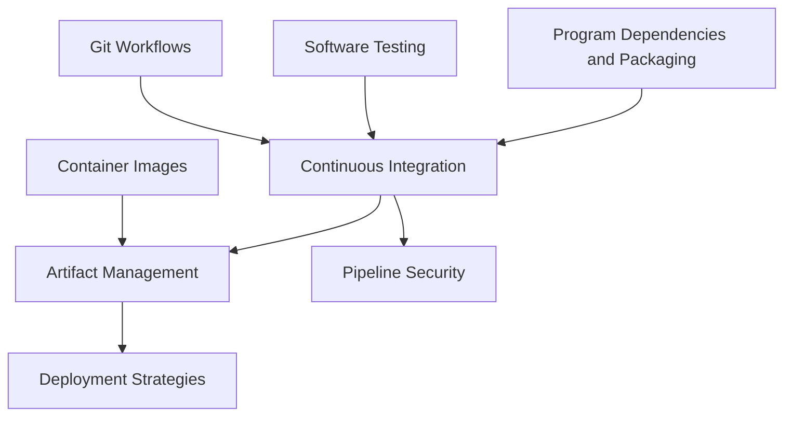

# CI-CD

<!-- Generated map: edit curriculum.yaml, then run scripts/curriculum.py build. -->

[Master curriculum](../CURRICULUM.md) · [Model and editing guide](../CONTRIBUTING.md)

## Purpose

Build and validate changes, produce artifacts, and deploy them with controlled exposure.

## Prerequisites

[[07-git/README#Git Workflows|Git Workflows]] · [Git Workflows](../07-git/README.md#git-workflows); [[06-software-engineering/README#Software Testing|Software Testing]] · [Software Testing](../06-software-engineering/README.md#software-testing); [[05-programming/README#Program Dependencies and Packaging|Program Dependencies and Packaging]] · [Program Dependencies and Packaging](../05-programming/README.md#program-dependencies)

These orient entry into the domain; each topic below has its own requirements. They are not inherited gates.

## Recommended Learning Order

This is one dependency-compatible reading order. External prerequisites can be learned in parallel; numbering is guidance, not a completion checklist.

1. [Continuous Integration](README.md#ci-fundamentals)
2. [Artifact Management](README.md#artifact-management)
3. [Deployment Strategies](README.md#deployment-strategies)
4. [Pipeline Security](README.md#pipeline-security)

## Major Areas

### Continuous Integration

#### Continuous Integration

**Concepts:** Build; Test; Feedback; GitHub Actions; GitLab CI; Jenkins; Runners and agents.

**Prerequisites:** [[07-git/README#Git Workflows|Git Workflows]] · [Git Workflows](../07-git/README.md#git-workflows); [[06-software-engineering/README#Software Testing|Software Testing]] · [Software Testing](../06-software-engineering/README.md#software-testing); [[05-programming/README#Program Dependencies and Packaging|Program Dependencies and Packaging]] · [Program Dependencies and Packaging](../05-programming/README.md#program-dependencies)

#### Artifact Management

**Concepts:** Immutable artifacts; Versioning; Container build pipelines; Promotion.

**Prerequisites:** [[15-ci-cd/README#Continuous Integration|Continuous Integration]] · [Continuous Integration](README.md#ci-fundamentals); [[09-containers/README#Container Images|Container Images]] · [Container Images](../09-containers/README.md#container-images)

### Continuous Delivery

#### Deployment Strategies

**Concepts:** Continuous delivery; Continuous deployment; Rolling deployment; Blue-green; Canary; Rollback.

**Prerequisites:** [[15-ci-cd/README#Artifact Management|Artifact Management]] · [Artifact Management](README.md#artifact-management); [[04-networking/README#Proxies and Load Balancing|Proxies and Load Balancing]] · [Proxies and Load Balancing](../04-networking/README.md#proxies-load-balancing)

#### Pipeline Security

**Concepts:** Runner isolation; Secrets; Permissions; Provenance; Untrusted contributions.

**Prerequisites:** [[15-ci-cd/README#Continuous Integration|Continuous Integration]] · [Continuous Integration](README.md#ci-fundamentals); [[18-security/README#Supply Chain Security|Supply Chain Security]] · [Supply Chain Security](../18-security/README.md#supply-chain-security); [[18-security/README#Secrets and Key Management|Secrets and Key Management]] · [Secrets and Key Management](../18-security/README.md#secrets-key-management)

## Dependency Sketch

Selected direct prerequisite edges, not the entire domain graph. Arrows mean “learn before”.

## Leads To

[[12-infrastructure-as-code/README#Infrastructure Testing and Delivery|Infrastructure Testing and Delivery]] · [Infrastructure Testing and Delivery](../12-infrastructure-as-code/README.md#infrastructure-testing); [[16-gitops/README#Argo CD|Argo CD]] · [Argo CD](../16-gitops/README.md#argo-cd); [[22-production-operations/README#Operational Readiness|Operational Readiness]] · [Operational Readiness](../22-production-operations/README.md#operational-readiness)

## Reference Roadmaps

Use these for coverage and further exploration; the prerequisite relationships here are curated independently.

- [roadmap.sh — DevOps](https://roadmap.sh/devops)

[Reference review and scope decisions](../references/roadmap-sh.md)
