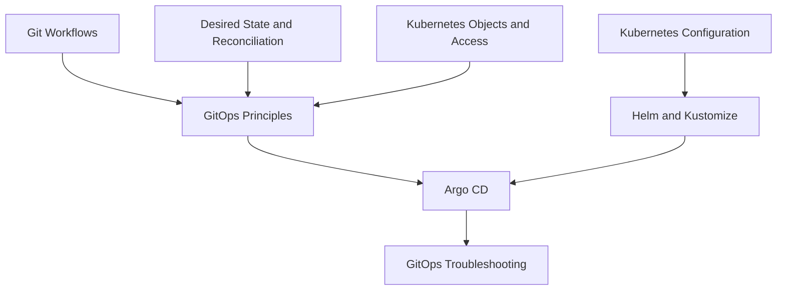

# GitOps

<!-- Generated map: edit curriculum.yaml, then run scripts/curriculum.py build. -->

[Master curriculum](../CURRICULUM.md) · [Model and editing guide](../CONTRIBUTING.md)

## Purpose

Apply versioned desired state through reconciliation with clear ownership and recovery paths.

## Prerequisites

[[12-infrastructure-as-code/README#Desired State and Reconciliation|Desired State and Reconciliation]] · [Desired State and Reconciliation](../12-infrastructure-as-code/README.md#desired-state); [[07-git/README#Git Workflows|Git Workflows]] · [Git Workflows](../07-git/README.md#git-workflows); [[14-kubernetes/README#Kubernetes Objects and Access|Kubernetes Objects and Access]] · [Kubernetes Objects and Access](../14-kubernetes/README.md#kubernetes-objects)

These orient entry into the domain; each topic below has its own requirements. They are not inherited gates.

## Recommended Learning Order

This is one dependency-compatible reading order. External prerequisites can be learned in parallel; numbering is guidance, not a completion checklist.

1. [GitOps Principles](README.md#gitops-principles)
2. [Helm and Kustomize](README.md#helm-kustomize)
3. [Argo CD](README.md#argo-cd)
4. [GitOps Troubleshooting](README.md#gitops-troubleshooting)

## Major Areas

### Principles and Configuration

#### GitOps Principles

**Concepts:** Versioned desired state; Pull-based delivery; Reconciliation; Drift; Ownership.

**Prerequisites:** [[12-infrastructure-as-code/README#Desired State and Reconciliation|Desired State and Reconciliation]] · [Desired State and Reconciliation](../12-infrastructure-as-code/README.md#desired-state); [[07-git/README#Git Workflows|Git Workflows]] · [Git Workflows](../07-git/README.md#git-workflows); [[14-kubernetes/README#Kubernetes Objects and Access|Kubernetes Objects and Access]] · [Kubernetes Objects and Access](../14-kubernetes/README.md#kubernetes-objects)

#### Helm and Kustomize

**Concepts:** Charts; Values; Templates; Bases; Overlays; Rendered configuration.

**Prerequisites:** [[14-kubernetes/README#Kubernetes Configuration|Kubernetes Configuration]] · [Kubernetes Configuration](../14-kubernetes/README.md#kubernetes-configuration)

### Controllers and Diagnosis

#### Argo CD

**Concepts:** Application; ApplicationSet; Sync; Sync waves; Health; Drift.

**Prerequisites:** [[16-gitops/README#GitOps Principles|GitOps Principles]] · [GitOps Principles](README.md#gitops-principles); [[16-gitops/README#Helm and Kustomize|Helm and Kustomize]] · [Helm and Kustomize](README.md#helm-kustomize); [[15-ci-cd/README#Deployment Strategies|Deployment Strategies]] · [Deployment Strategies](../15-ci-cd/README.md#deployment-strategies)

**Implements / applies:** [[16-gitops/README#GitOps Principles|GitOps Principles]] · [GitOps Principles](README.md#gitops-principles); [[12-infrastructure-as-code/README#Desired State and Reconciliation|Desired State and Reconciliation]] · [Desired State and Reconciliation](../12-infrastructure-as-code/README.md#desired-state)

#### GitOps Troubleshooting

**Concepts:** Render failures; Sync failures; Health checks; Competing controllers.

**Prerequisites:** [[16-gitops/README#Argo CD|Argo CD]] · [Argo CD](README.md#argo-cd); [[14-kubernetes/README#Kubernetes Troubleshooting|Kubernetes Troubleshooting]] · [Kubernetes Troubleshooting](../14-kubernetes/README.md#kubernetes-troubleshooting)

## Dependency Sketch

Selected direct prerequisite edges, not the entire domain graph. Arrows mean “learn before”.

## Leads To

[[23-advanced/README#Platform Engineering|Platform Engineering]] · [Platform Engineering](../23-advanced/README.md#platform-engineering)
