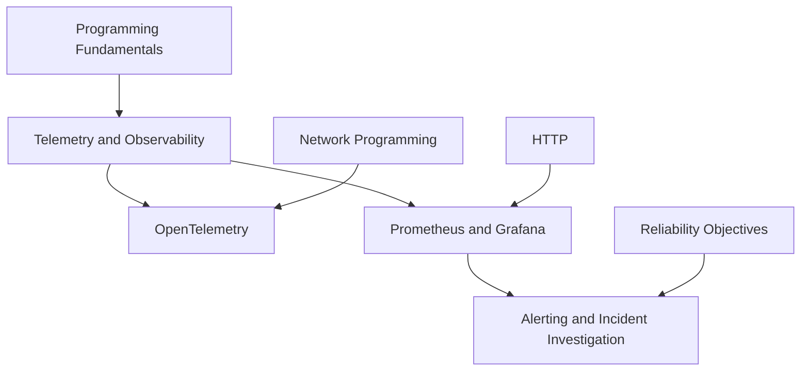

# Observability

<!-- Generated map: edit curriculum.yaml, then run scripts/curriculum.py build. -->

[Master curriculum](../CURRICULUM.md) · [Model and editing guide](../CONTRIBUTING.md)

## Purpose

Use telemetry to explain system behavior and support actionable diagnosis.

## Prerequisites

[[00-foundations/README#Programming Fundamentals|Programming Fundamentals]] · [Programming Fundamentals](../00-foundations/README.md#programming-fundamentals)

These orient entry into the domain; each topic below has its own requirements. They are not inherited gates.

## Recommended Learning Order

This is one dependency-compatible reading order. External prerequisites can be learned in parallel; numbering is guidance, not a completion checklist.

1. [Telemetry and Observability](README.md#telemetry)
2. [OpenTelemetry](README.md#opentelemetry)
3. [Prometheus and Grafana](README.md#prometheus-grafana)
4. [Alerting and Incident Investigation](README.md#alerting-investigation)

## Major Areas

### Signals and Instrumentation

#### Telemetry and Observability

**Concepts:** Monitoring; Metrics; Logs; Traces; Signal context; Instrumentation.

**Prerequisites:** [[00-foundations/README#Programming Fundamentals|Programming Fundamentals]] · [Programming Fundamentals](../00-foundations/README.md#programming-fundamentals)

#### OpenTelemetry

**Concepts:** Instrumentation; Context propagation; Collectors; Exporters.

**Prerequisites:** [[17-observability/README#Telemetry and Observability|Telemetry and Observability]] · [Telemetry and Observability](README.md#telemetry); [[05-programming/README#Network Programming|Network Programming]] · [Network Programming](../05-programming/README.md#network-programming)

**Implements / applies:** [[17-observability/README#Telemetry and Observability|Telemetry and Observability]] · [Telemetry and Observability](README.md#telemetry)

### Monitoring and Investigation

#### Prometheus and Grafana

**Concepts:** Scraping; Time series; Labels; PromQL; Dashboards; Cardinality.

**Prerequisites:** [[17-observability/README#Telemetry and Observability|Telemetry and Observability]] · [Telemetry and Observability](README.md#telemetry); [[04-networking/README#HTTP|HTTP]] · [HTTP](../04-networking/README.md#http)

**Implements / applies:** [[17-observability/README#Telemetry and Observability|Telemetry and Observability]] · [Telemetry and Observability](README.md#telemetry)

#### Alerting and Incident Investigation

**Concepts:** Actionable alerts; Symptoms; Correlation; Investigation queries.

**Prerequisites:** [[17-observability/README#Prometheus and Grafana|Prometheus and Grafana]] · [Prometheus and Grafana](README.md#prometheus-grafana); [[20-sre/README#Reliability Objectives|Reliability Objectives]] · [Reliability Objectives](../20-sre/README.md#reliability-objectives)

## Dependency Sketch

Selected direct prerequisite edges, not the entire domain graph. Arrows mean “learn before”.

## Leads To

[[11-aws/README#AWS Operations and Secrets|AWS Operations and Secrets]] · [AWS Operations and Secrets](../11-aws/README.md#aws-operations); [[14-kubernetes/README#Kubernetes Troubleshooting|Kubernetes Troubleshooting]] · [Kubernetes Troubleshooting](../14-kubernetes/README.md#kubernetes-troubleshooting); [[20-sre/README#Reliability Objectives|Reliability Objectives]] · [Reliability Objectives](../20-sre/README.md#reliability-objectives); [[22-production-operations/README#Incident Management|Incident Management]] · [Incident Management](../22-production-operations/README.md#incident-management)
