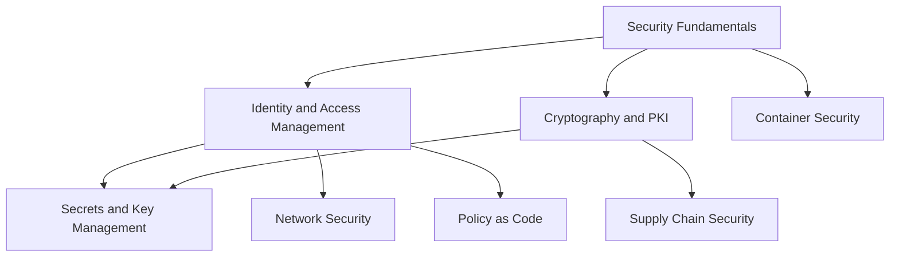

# Security

<!-- Generated map: edit curriculum.yaml, then run scripts/curriculum.py build. -->

[Master curriculum](../CURRICULUM.md) · [Model and editing guide](../CONTRIBUTING.md)

## Purpose

Understand trust, identities, threat boundaries, and safeguards across systems.

## Prerequisites

[[00-foundations/README#Computer Fundamentals|Computer Fundamentals]] · [Computer Fundamentals](../00-foundations/README.md#computer-fundamentals)

These orient entry into the domain; each topic below has its own requirements. They are not inherited gates.

## Recommended Learning Order

This is one dependency-compatible reading order. External prerequisites can be learned in parallel; numbering is guidance, not a completion checklist.

1. [Security Fundamentals](README.md#security-fundamentals)
2. [Identity and Access Management](identity-access.md)
3. [Cryptography and PKI](README.md#pki)
4. [Secrets and Key Management](README.md#secrets-key-management)
5. [Network Security](README.md#network-security)
6. [Container Security](README.md#container-security)
7. [Supply Chain Security](README.md#supply-chain-security)
8. [Policy as Code](README.md#policy-as-code)

## Major Areas

### Trust and Identity

#### Security Fundamentals

**Concepts:** Threat modeling; Least privilege; Defense in depth; Zero Trust concepts.

**Prerequisites:** [[00-foundations/README#Computer Fundamentals|Computer Fundamentals]] · [Computer Fundamentals](../00-foundations/README.md#computer-fundamentals)

#### Identity and Access Management

**Concepts:** Identity; Authentication; Authorization; IAM; RBAC; Federation; OIDC; SAML.

**Prerequisites:** [[18-security/README#Security Fundamentals|Security Fundamentals]] · [Security Fundamentals](README.md#security-fundamentals)

**Topic note:** [[18-security/identity-access|Identity and Access Management]] · [Identity and Access Management](identity-access.md)

**Related:** [[03-linux/README#Linux Users and Permissions|Linux Users and Permissions]] · [Linux Users and Permissions](../03-linux/README.md#linux-users-permissions); [[11-aws/README#AWS IAM and Organizations|AWS IAM and Organizations]] · [AWS IAM and Organizations](../11-aws/README.md#aws-iam); [[14-kubernetes/README#Kubernetes Security|Kubernetes Security]] · [Kubernetes Security](../14-kubernetes/README.md#kubernetes-security); [[18-security/README#Secrets and Key Management|Secrets and Key Management]] · [Secrets and Key Management](README.md#secrets-key-management)

#### Cryptography and PKI

**Concepts:** Encryption; Hashing; Signatures; Certificates; Trust chains; PKI.

**Prerequisites:** [[18-security/README#Security Fundamentals|Security Fundamentals]] · [Security Fundamentals](README.md#security-fundamentals)

#### Secrets and Key Management

**Concepts:** Secret lifecycle; Rotation; Encryption keys; Envelope encryption.

**Prerequisites:** [[18-security/identity-access|Identity and Access Management]] · [Identity and Access Management](identity-access.md); [[18-security/README#Cryptography and PKI|Cryptography and PKI]] · [Cryptography and PKI](README.md#pki)

### System and Delivery Controls

#### Network Security

**Concepts:** Firewalls; Segmentation; Trust boundaries; Stateful filtering.

**Prerequisites:** [[04-networking/README#Routing|Routing]] · [Routing](../04-networking/README.md#routing); [[18-security/identity-access|Identity and Access Management]] · [Identity and Access Management](identity-access.md)

#### Container Security

**Concepts:** Image security; Runtime privileges; Vulnerability management.

**Prerequisites:** [[09-containers/README#Container Images|Container Images]] · [Container Images](../09-containers/README.md#container-images); [[18-security/README#Security Fundamentals|Security Fundamentals]] · [Security Fundamentals](README.md#security-fundamentals)

#### Supply Chain Security

**Concepts:** Dependency trust; SBOM; Signing; Provenance; Vulnerability response.

**Prerequisites:** [[05-programming/README#Program Dependencies and Packaging|Program Dependencies and Packaging]] · [Program Dependencies and Packaging](../05-programming/README.md#program-dependencies); [[18-security/README#Cryptography and PKI|Cryptography and PKI]] · [Cryptography and PKI](README.md#pki)

#### Policy as Code

**Concepts:** Policy evaluation; OPA; Gatekeeper; Audit and enforcement.

**Prerequisites:** [[18-security/identity-access|Identity and Access Management]] · [Identity and Access Management](identity-access.md); [[12-infrastructure-as-code/README#Desired State and Reconciliation|Desired State and Reconciliation]] · [Desired State and Reconciliation](../12-infrastructure-as-code/README.md#desired-state)

## Dependency Sketch

Selected direct prerequisite edges, not the entire domain graph. Arrows mean “learn before”.

## Leads To

[[03-linux/README#Linux Users and Permissions|Linux Users and Permissions]] · [Linux Users and Permissions](../03-linux/README.md#linux-users-permissions); [[04-networking/README#TLS|TLS]] · [TLS](../04-networking/README.md#tls); [[04-networking/README#Network Troubleshooting|Network Troubleshooting]] · [Network Troubleshooting](../04-networking/README.md#network-troubleshooting); [[04-networking/README#Tunneling and VPNs|Tunneling and VPNs]] · [Tunneling and VPNs](../04-networking/README.md#vpn-tunneling); [[06-software-engineering/README#API Design|API Design]] · [API Design](../06-software-engineering/README.md#api-design); [[10-cloud/README#Cloud Governance and Cost|Cloud Governance and Cost]] · [Cloud Governance and Cost](../10-cloud/README.md#cloud-governance); [[11-aws/README#AWS IAM and Organizations|AWS IAM and Organizations]] · [AWS IAM and Organizations](../11-aws/README.md#aws-iam); [[11-aws/README#AWS VPC|AWS VPC]] · [AWS VPC](../11-aws/README.md#aws-vpc); [[11-aws/README#AWS Operations and Secrets|AWS Operations and Secrets]] · [AWS Operations and Secrets](../11-aws/README.md#aws-operations); [[13-configuration-management/README#Ansible Automation|Ansible Automation]] · [Ansible Automation](../13-configuration-management/README.md#ansible-automation); [[14-kubernetes/README#Kubernetes Configuration|Kubernetes Configuration]] · [Kubernetes Configuration](../14-kubernetes/README.md#kubernetes-configuration); [[14-kubernetes/README#Kubernetes Security|Kubernetes Security]] · [Kubernetes Security](../14-kubernetes/README.md#kubernetes-security); [[15-ci-cd/README#Pipeline Security|Pipeline Security]] · [Pipeline Security](../15-ci-cd/README.md#pipeline-security); [[23-advanced/README#Service Mesh|Service Mesh]] · [Service Mesh](../23-advanced/README.md#service-mesh)

## Reference Roadmaps

Use these for coverage and further exploration; the prerequisite relationships here are curated independently.

- [roadmap.sh — DevOps](https://roadmap.sh/devops)

[Reference review and scope decisions](../references/roadmap-sh.md)
