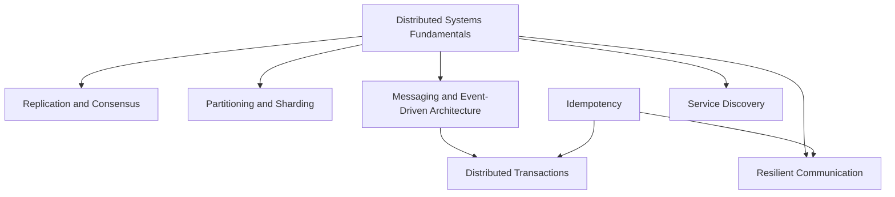

# Distributed Systems

<!-- Generated map: edit curriculum.yaml, then run scripts/curriculum.py build. -->

[Master curriculum](../CURRICULUM.md) · [Model and editing guide](../CONTRIBUTING.md)

## Purpose

Reason about partial failure, state coordination, and communication between independent nodes.

## Prerequisites

[[02-operating-systems/README#Concurrency|Concurrency]] · [Concurrency](../02-operating-systems/README.md#concurrency); [[04-networking/README#TCP|TCP]] · [TCP](../04-networking/README.md#tcp); [[08-databases/README#Database Transactions|Database Transactions]] · [Database Transactions](../08-databases/README.md#database-transactions)

These orient entry into the domain; each topic below has its own requirements. They are not inherited gates.

## Recommended Learning Order

This is one dependency-compatible reading order. External prerequisites can be learned in parallel; numbering is guidance, not a completion checklist.

1. [Distributed Systems Fundamentals](README.md#distributed-fundamentals)
2. [Replication and Consensus](README.md#replication-consensus)
3. [Partitioning and Sharding](README.md#partitioning-sharding)
4. [Messaging and Event-Driven Architecture](README.md#messaging)
5. [Idempotency](README.md#idempotency)
6. [Resilient Communication](README.md#resilient-communication)
7. [Distributed Transactions](README.md#distributed-transactions)
8. [Service Discovery](README.md#service-discovery)
9. [Overload Protection](README.md#overload-protection)

## Major Areas

### Failure and State

#### Distributed Systems Fundamentals

**Concepts:** Partial failure; Time; Network partitions; CAP theorem; Consistency; Availability; Partition tolerance.

**Prerequisites:** [[02-operating-systems/README#Concurrency|Concurrency]] · [Concurrency](../02-operating-systems/README.md#concurrency); [[04-networking/README#TCP|TCP]] · [TCP](../04-networking/README.md#tcp); [[08-databases/README#Database Transactions|Database Transactions]] · [Database Transactions](../08-databases/README.md#database-transactions)

#### Replication and Consensus

**Concepts:** Replication; Leader election; Consensus; Quorum.

**Prerequisites:** [[19-distributed-systems/README#Distributed Systems Fundamentals|Distributed Systems Fundamentals]] · [Distributed Systems Fundamentals](README.md#distributed-fundamentals)

#### Partitioning and Sharding

**Concepts:** Partition keys; Hotspots; Rebalancing; Ownership.

**Prerequisites:** [[19-distributed-systems/README#Distributed Systems Fundamentals|Distributed Systems Fundamentals]] · [Distributed Systems Fundamentals](README.md#distributed-fundamentals); [[08-databases/README#Data Modeling|Data Modeling]] · [Data Modeling](../08-databases/README.md#data-modeling)

### Communication and Reliability

#### Messaging and Event-Driven Architecture

**Concepts:** Queues; Pub-sub; Events; Ordering; Delivery guarantees.

**Prerequisites:** [[19-distributed-systems/README#Distributed Systems Fundamentals|Distributed Systems Fundamentals]] · [Distributed Systems Fundamentals](README.md#distributed-fundamentals)

#### Idempotency

**Concepts:** Repeated operations; Stable effects; Deduplication keys; Safe automation.

**Prerequisites:** [[00-foundations/README#Programming Fundamentals|Programming Fundamentals]] · [Programming Fundamentals](../00-foundations/README.md#programming-fundamentals)

**Related:** [[19-distributed-systems/README#Resilient Communication|Resilient Communication]] · [Resilient Communication](README.md#resilient-communication); [[13-configuration-management/README#Configuration Management Principles|Configuration Management Principles]] · [Configuration Management Principles](../13-configuration-management/README.md#configuration-management-principles)

#### Resilient Communication

**Concepts:** Timeouts; Retries; Backoff; Jitter; Circuit breakers.

**Prerequisites:** [[19-distributed-systems/README#Distributed Systems Fundamentals|Distributed Systems Fundamentals]] · [Distributed Systems Fundamentals](README.md#distributed-fundamentals); [[19-distributed-systems/README#Idempotency|Idempotency]] · [Idempotency](README.md#idempotency)

#### Distributed Transactions

**Concepts:** Atomic commit; Sagas; Outbox; Compensation.

**Prerequisites:** [[08-databases/README#Database Transactions|Database Transactions]] · [Database Transactions](../08-databases/README.md#database-transactions); [[19-distributed-systems/README#Messaging and Event-Driven Architecture|Messaging and Event-Driven Architecture]] · [Messaging and Event-Driven Architecture](README.md#messaging); [[19-distributed-systems/README#Idempotency|Idempotency]] · [Idempotency](README.md#idempotency)

#### Service Discovery

**Concepts:** Naming and registration; Endpoint freshness; Health; Client-side discovery; Server-side discovery.

**Prerequisites:** [[04-networking/dns|DNS]] · [DNS](../04-networking/dns.md); [[19-distributed-systems/README#Distributed Systems Fundamentals|Distributed Systems Fundamentals]] · [Distributed Systems Fundamentals](README.md#distributed-fundamentals)

**Related:** [[14-kubernetes/kubernetes-services|Kubernetes Services]] · [Kubernetes Services](../14-kubernetes/kubernetes-services.md)

#### Overload Protection

**Concepts:** Backpressure; Admission control; Rate limiting; Load shedding; Bulkheads; Retry amplification.

**Prerequisites:** [[19-distributed-systems/README#Resilient Communication|Resilient Communication]] · [Resilient Communication](README.md#resilient-communication); [[20-sre/README#Capacity and Performance|Capacity and Performance]] · [Capacity and Performance](../20-sre/README.md#capacity-performance)

## Dependency Sketch

Selected direct prerequisite edges, not the entire domain graph. Arrows mean “learn before”.

## Leads To

[[11-aws/README#AWS Messaging|AWS Messaging]] · [AWS Messaging](../11-aws/README.md#aws-messaging); [[11-aws/README#AWS Serverless and Edge Delivery|AWS Serverless and Edge Delivery]] · [AWS Serverless and Edge Delivery](../11-aws/README.md#aws-serverless-edge); [[12-infrastructure-as-code/README#Infrastructure as Code Principles|Infrastructure as Code Principles]] · [Infrastructure as Code Principles](../12-infrastructure-as-code/README.md#infrastructure-as-code-principles); [[13-configuration-management/README#Configuration Management Principles|Configuration Management Principles]] · [Configuration Management Principles](../13-configuration-management/README.md#configuration-management-principles); [[20-sre/README#Resilience Engineering|Resilience Engineering]] · [Resilience Engineering](../20-sre/README.md#resilience-engineering); [[21-system-design/README#Caching|Caching]] · [Caching](../21-system-design/README.md#caching); [[21-system-design/README#Scalable Architecture|Scalable Architecture]] · [Scalable Architecture](../21-system-design/README.md#scalable-architecture); [[21-system-design/README#Architecture Evolution|Architecture Evolution]] · [Architecture Evolution](../21-system-design/README.md#architecture-evolution); [[23-advanced/README#Service Mesh|Service Mesh]] · [Service Mesh](../23-advanced/README.md#service-mesh)

## Reference Roadmaps

Use these for coverage and further exploration; the prerequisite relationships here are curated independently.

- [roadmap.sh — System Design](https://roadmap.sh/system-design)

[Reference review and scope decisions](../references/roadmap-sh.md)
