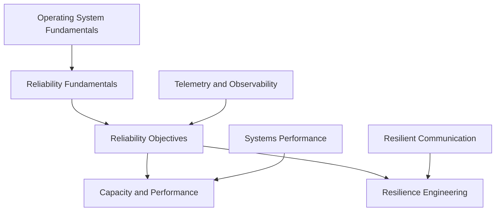

# Site Reliability Engineering

<!-- Generated map: edit curriculum.yaml, then run scripts/curriculum.py build. -->

[Master curriculum](../CURRICULUM.md) · [Model and editing guide](../CONTRIBUTING.md)

## Purpose

Translate user expectations into reliability decisions and sustainable operations.

## Prerequisites

[[02-operating-systems/README#Operating System Fundamentals|Operating System Fundamentals]] · [Operating System Fundamentals](../02-operating-systems/README.md#os-fundamentals)

These orient entry into the domain; each topic below has its own requirements. They are not inherited gates.

## Recommended Learning Order

This is one dependency-compatible reading order. External prerequisites can be learned in parallel; numbering is guidance, not a completion checklist.

1. [Reliability Fundamentals](README.md#reliability-fundamentals)
2. [Reliability Objectives](README.md#reliability-objectives)
3. [Capacity and Performance](README.md#capacity-performance)
4. [Resilience Engineering](README.md#resilience-engineering)

## Major Areas

### Reliability Foundations

#### Reliability Fundamentals

**Concepts:** Reliability; Availability; Failure domains; Redundancy.

**Prerequisites:** [[02-operating-systems/README#Operating System Fundamentals|Operating System Fundamentals]] · [Operating System Fundamentals](../02-operating-systems/README.md#os-fundamentals)

#### Reliability Objectives

**Concepts:** SLI; SLO; SLA; Error budgets; User journeys.

**Prerequisites:** [[20-sre/README#Reliability Fundamentals|Reliability Fundamentals]] · [Reliability Fundamentals](README.md#reliability-fundamentals); [[17-observability/README#Telemetry and Observability|Telemetry and Observability]] · [Telemetry and Observability](../17-observability/README.md#telemetry)

**Related:** [[22-production-operations/README#Incident Management|Incident Management]] · [Incident Management](../22-production-operations/README.md#incident-management)

### Capacity and Resilience

#### Capacity and Performance

**Concepts:** Capacity planning; Saturation; Scaling; Performance; Load tests.

**Prerequisites:** [[01-computer-systems/README#Systems Performance|Systems Performance]] · [Systems Performance](../01-computer-systems/README.md#systems-performance); [[20-sre/README#Reliability Objectives|Reliability Objectives]] · [Reliability Objectives](README.md#reliability-objectives)

#### Resilience Engineering

**Concepts:** Resilience; Chaos engineering; Hypotheses; Blast radius; Recovery verification.

**Prerequisites:** [[19-distributed-systems/README#Resilient Communication|Resilient Communication]] · [Resilient Communication](../19-distributed-systems/README.md#resilient-communication); [[20-sre/README#Reliability Objectives|Reliability Objectives]] · [Reliability Objectives](README.md#reliability-objectives); [[22-production-operations/README#Backup and Disaster Recovery|Backup and Disaster Recovery]] · [Backup and Disaster Recovery](../22-production-operations/README.md#backup-recovery)

## Dependency Sketch

Selected direct prerequisite edges, not the entire domain graph. Arrows mean “learn before”.

## Leads To

[[10-cloud/README#Cloud Architecture|Cloud Architecture]] · [Cloud Architecture](../10-cloud/README.md#cloud-architecture); [[17-observability/README#Alerting and Incident Investigation|Alerting and Incident Investigation]] · [Alerting and Incident Investigation](../17-observability/README.md#alerting-investigation); [[19-distributed-systems/README#Overload Protection|Overload Protection]] · [Overload Protection](../19-distributed-systems/README.md#overload-protection); [[21-system-design/README#System Design Method|System Design Method]] · [System Design Method](../21-system-design/README.md#system-design-method); [[22-production-operations/README#Operational Readiness|Operational Readiness]] · [Operational Readiness](../22-production-operations/README.md#operational-readiness); [[22-production-operations/README#Backup and Disaster Recovery|Backup and Disaster Recovery]] · [Backup and Disaster Recovery](../22-production-operations/README.md#backup-recovery); [[23-advanced/README#Systems Performance Specialization|Systems Performance Specialization]] · [Systems Performance Specialization](../23-advanced/README.md#performance-specialization)

## Reference Roadmaps

Use these for coverage and further exploration; the prerequisite relationships here are curated independently.

- [roadmap.sh — System Design](https://roadmap.sh/system-design)

[Reference review and scope decisions](../references/roadmap-sh.md)
