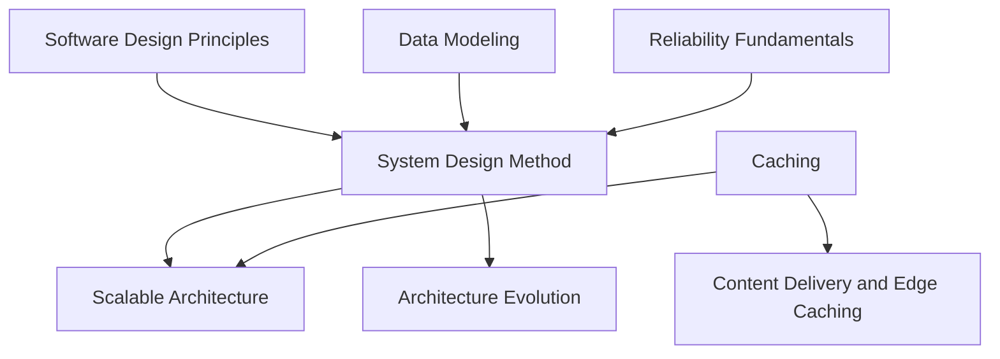

# System Design

<!-- Generated map: edit curriculum.yaml, then run scripts/curriculum.py build. -->

[Master curriculum](../CURRICULUM.md) · [Model and editing guide](../CONTRIBUTING.md)

## Purpose

Combine concepts into architectures with explicit requirements and tradeoffs.

## Prerequisites

[[06-software-engineering/README#Software Design Principles|Software Design Principles]] · [Software Design Principles](../06-software-engineering/README.md#software-design); [[20-sre/README#Reliability Fundamentals|Reliability Fundamentals]] · [Reliability Fundamentals](../20-sre/README.md#reliability-fundamentals); [[08-databases/README#Data Modeling|Data Modeling]] · [Data Modeling](../08-databases/README.md#data-modeling)

These orient entry into the domain; each topic below has its own requirements. They are not inherited gates.

## Recommended Learning Order

This is one dependency-compatible reading order. External prerequisites can be learned in parallel; numbering is guidance, not a completion checklist.

1. [System Design Method](README.md#system-design-method)
2. [Caching](README.md#caching)
3. [Scalable Architecture](README.md#scalable-architecture)
4. [Content Delivery and Edge Caching](README.md#content-delivery)
5. [Architecture Evolution](README.md#architecture-evolution)

## Major Areas

### Requirements and Estimation

#### System Design Method

**Concepts:** Functional requirements; Non-functional requirements; Latency; Throughput; Capacity estimation; High-level architecture; Low-level design; Tradeoffs.

**Prerequisites:** [[06-software-engineering/README#Software Design Principles|Software Design Principles]] · [Software Design Principles](../06-software-engineering/README.md#software-design); [[20-sre/README#Reliability Fundamentals|Reliability Fundamentals]] · [Reliability Fundamentals](../20-sre/README.md#reliability-fundamentals); [[08-databases/README#Data Modeling|Data Modeling]] · [Data Modeling](../08-databases/README.md#data-modeling)

### Architecture Patterns and Tradeoffs

#### Caching

**Concepts:** Cache keys; Invalidation; TTL; Eviction; Stampedes.

**Prerequisites:** [[00-foundations/README#Data Structures and Algorithms|Data Structures and Algorithms]] · [Data Structures and Algorithms](../00-foundations/README.md#data-structures-algorithms); [[19-distributed-systems/README#Distributed Systems Fundamentals|Distributed Systems Fundamentals]] · [Distributed Systems Fundamentals](../19-distributed-systems/README.md#distributed-fundamentals)

#### Scalable Architecture

**Concepts:** Horizontal scaling; Vertical scaling; Databases; Load balancing; Queues; Event-driven systems; Replication; Consistency; Failure modes.

**Prerequisites:** [[21-system-design/README#System Design Method|System Design Method]] · [System Design Method](README.md#system-design-method); [[21-system-design/README#Caching|Caching]] · [Caching](README.md#caching); [[19-distributed-systems/README#Partitioning and Sharding|Partitioning and Sharding]] · [Partitioning and Sharding](../19-distributed-systems/README.md#partitioning-sharding); [[19-distributed-systems/README#Replication and Consensus|Replication and Consensus]] · [Replication and Consensus](../19-distributed-systems/README.md#replication-consensus); [[19-distributed-systems/README#Messaging and Event-Driven Architecture|Messaging and Event-Driven Architecture]] · [Messaging and Event-Driven Architecture](../19-distributed-systems/README.md#messaging); [[04-networking/README#Proxies and Load Balancing|Proxies and Load Balancing]] · [Proxies and Load Balancing](../04-networking/README.md#proxies-load-balancing)

#### Content Delivery and Edge Caching

**Concepts:** Origin and edge; Cache keys; Invalidation; TTL; Static content; Regional delivery.

**Prerequisites:** [[21-system-design/README#Caching|Caching]] · [Caching](README.md#caching); [[04-networking/README#HTTP|HTTP]] · [HTTP](../04-networking/README.md#http); [[04-networking/dns|DNS]] · [DNS](../04-networking/dns.md)

**Related:** [[11-aws/README#AWS Traffic and DNS|AWS Traffic and DNS]] · [AWS Traffic and DNS](../11-aws/README.md#aws-traffic)

#### Architecture Evolution

**Concepts:** Modular monoliths; Microservice boundaries; Strangler migration; CQRS; Event sourcing; Distributed complexity.

**Prerequisites:** [[21-system-design/README#System Design Method|System Design Method]] · [System Design Method](README.md#system-design-method); [[19-distributed-systems/README#Messaging and Event-Driven Architecture|Messaging and Event-Driven Architecture]] · [Messaging and Event-Driven Architecture](../19-distributed-systems/README.md#messaging); [[08-databases/README#Database Transactions|Database Transactions]] · [Database Transactions](../08-databases/README.md#database-transactions)

**Related:** [[19-distributed-systems/README#Distributed Transactions|Distributed Transactions]] · [Distributed Transactions](../19-distributed-systems/README.md#distributed-transactions)

## Dependency Sketch

Selected direct prerequisite edges, not the entire domain graph. Arrows mean “learn before”.

## Leads To

[[11-aws/README#AWS Serverless and Edge Delivery|AWS Serverless and Edge Delivery]] · [AWS Serverless and Edge Delivery](../11-aws/README.md#aws-serverless-edge); [[23-advanced/README#Platform Engineering|Platform Engineering]] · [Platform Engineering](../23-advanced/README.md#platform-engineering)

## Reference Roadmaps

Use these for coverage and further exploration; the prerequisite relationships here are curated independently.

- [roadmap.sh — System Design](https://roadmap.sh/system-design)

[Reference review and scope decisions](../references/roadmap-sh.md)
