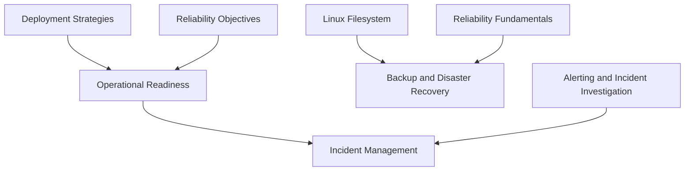

# Production Operations

<!-- Generated map: edit curriculum.yaml, then run scripts/curriculum.py build. -->

[Master curriculum](../CURRICULUM.md) · [Model and editing guide](../CONTRIBUTING.md)

## Purpose

Operate services through incidents, changes, and tested recovery procedures.

## Prerequisites

[[20-sre/README#Reliability Objectives|Reliability Objectives]] · [Reliability Objectives](../20-sre/README.md#reliability-objectives); [[15-ci-cd/README#Deployment Strategies|Deployment Strategies]] · [Deployment Strategies](../15-ci-cd/README.md#deployment-strategies)

These orient entry into the domain; each topic below has its own requirements. They are not inherited gates.

## Recommended Learning Order

This is one dependency-compatible reading order. External prerequisites can be learned in parallel; numbering is guidance, not a completion checklist.

1. [Operational Readiness](README.md#operational-readiness)
2. [Backup and Disaster Recovery](README.md#backup-recovery)
3. [Incident Management](README.md#incident-management)

## Major Areas

### Readiness and Change

#### Operational Readiness

**Concepts:** Runbooks; Ownership; On-call; Handoffs; Safe changes.

**Prerequisites:** [[20-sre/README#Reliability Objectives|Reliability Objectives]] · [Reliability Objectives](../20-sre/README.md#reliability-objectives); [[15-ci-cd/README#Deployment Strategies|Deployment Strategies]] · [Deployment Strategies](../15-ci-cd/README.md#deployment-strategies)

#### Backup and Disaster Recovery

**Concepts:** Backup; Restore; Recovery; RPO; RTO; Disaster recovery; Restore exercises.

**Prerequisites:** [[03-linux/README#Linux Filesystem|Linux Filesystem]] · [Linux Filesystem](../03-linux/README.md#linux-filesystem); [[20-sre/README#Reliability Fundamentals|Reliability Fundamentals]] · [Reliability Fundamentals](../20-sre/README.md#reliability-fundamentals)

### Response and Learning

#### Incident Management

**Concepts:** Triage; Coordination; Communication; Mitigation; RCA; Blameless learning.

**Prerequisites:** [[22-production-operations/README#Operational Readiness|Operational Readiness]] · [Operational Readiness](README.md#operational-readiness); [[17-observability/README#Alerting and Incident Investigation|Alerting and Incident Investigation]] · [Alerting and Incident Investigation](../17-observability/README.md#alerting-investigation)

## Dependency Sketch

Selected direct prerequisite edges, not the entire domain graph. Arrows mean “learn before”.

## Leads To

[[08-databases/README#Database Operations|Database Operations]] · [Database Operations](../08-databases/README.md#database-operations); [[14-kubernetes/README#Kubernetes Cluster Architecture and Operations|Kubernetes Cluster Architecture and Operations]] · [Kubernetes Cluster Architecture and Operations](../14-kubernetes/README.md#kubernetes-cluster-operations); [[20-sre/README#Resilience Engineering|Resilience Engineering]] · [Resilience Engineering](../20-sre/README.md#resilience-engineering)

## Reference Roadmaps

Use these for coverage and further exploration; the prerequisite relationships here are curated independently.

- [roadmap.sh — DevOps](https://roadmap.sh/devops)

[Reference review and scope decisions](../references/roadmap-sh.md)
