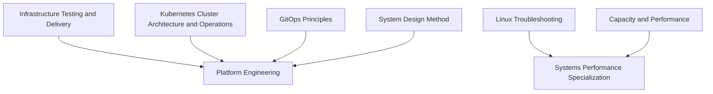

# Advanced and Specialization

<!-- Generated map: edit curriculum.yaml, then run scripts/curriculum.py build. -->

[Master curriculum](../CURRICULUM.md) · [Model and editing guide](../CONTRIBUTING.md)

## Purpose

Select deeper paths after mastering their foundations; expand from actual needs.

## Prerequisites

[[14-kubernetes/README#Kubernetes Cluster Architecture and Operations|Kubernetes Cluster Architecture and Operations]] · [Kubernetes Cluster Architecture and Operations](../14-kubernetes/README.md#kubernetes-cluster-operations); [[16-gitops/README#GitOps Principles|GitOps Principles]] · [GitOps Principles](../16-gitops/README.md#gitops-principles); [[12-infrastructure-as-code/README#Infrastructure Testing and Delivery|Infrastructure Testing and Delivery]] · [Infrastructure Testing and Delivery](../12-infrastructure-as-code/README.md#infrastructure-testing); [[21-system-design/README#System Design Method|System Design Method]] · [System Design Method](../21-system-design/README.md#system-design-method)

These orient entry into the domain; each topic below has its own requirements. They are not inherited gates.

## Recommended Learning Order

This is one dependency-compatible reading order. External prerequisites can be learned in parallel; numbering is guidance, not a completion checklist.

1. [Platform Engineering](README.md#platform-engineering)
2. [Systems Performance Specialization](README.md#performance-specialization)
3. [Service Mesh](README.md#service-mesh)

## Major Areas

### Specialization Paths

#### Platform Engineering

**Concepts:** Self-service interfaces; Golden paths; Platform contracts; Developer experience.

**Prerequisites:** [[14-kubernetes/README#Kubernetes Cluster Architecture and Operations|Kubernetes Cluster Architecture and Operations]] · [Kubernetes Cluster Architecture and Operations](../14-kubernetes/README.md#kubernetes-cluster-operations); [[16-gitops/README#GitOps Principles|GitOps Principles]] · [GitOps Principles](../16-gitops/README.md#gitops-principles); [[12-infrastructure-as-code/README#Infrastructure Testing and Delivery|Infrastructure Testing and Delivery]] · [Infrastructure Testing and Delivery](../12-infrastructure-as-code/README.md#infrastructure-testing); [[21-system-design/README#System Design Method|System Design Method]] · [System Design Method](../21-system-design/README.md#system-design-method)

#### Systems Performance Specialization

**Concepts:** Profiling; Workload characterization; Cross-layer bottlenecks.

**Prerequisites:** [[20-sre/README#Capacity and Performance|Capacity and Performance]] · [Capacity and Performance](../20-sre/README.md#capacity-performance); [[03-linux/README#Linux Troubleshooting|Linux Troubleshooting]] · [Linux Troubleshooting](../03-linux/README.md#linux-troubleshooting)

#### Service Mesh

**Concepts:** Service-to-service traffic policy; Workload identity; Mutual TLS; Traffic telemetry; Istio; Linkerd; Operational cost.

**Prerequisites:** [[14-kubernetes/README#Kubernetes Networking|Kubernetes Networking]] · [Kubernetes Networking](../14-kubernetes/README.md#kubernetes-networking); [[19-distributed-systems/README#Service Discovery|Service Discovery]] · [Service Discovery](../19-distributed-systems/README.md#service-discovery); [[04-networking/README#TLS|TLS]] · [TLS](../04-networking/README.md#tls); [[18-security/identity-access|Identity and Access Management]] · [Identity and Access Management](../18-security/identity-access.md); [[17-observability/README#Telemetry and Observability|Telemetry and Observability]] · [Telemetry and Observability](../17-observability/README.md#telemetry)

**Related:** [[19-distributed-systems/README#Overload Protection|Overload Protection]] · [Overload Protection](../19-distributed-systems/README.md#overload-protection)

## Dependency Sketch

Selected direct prerequisite edges, not the entire domain graph. Arrows mean “learn before”.

## Leads To

Specialize further according to real systems and learning needs.

## Reference Roadmaps

Use these for coverage and further exploration; the prerequisite relationships here are curated independently.

- [roadmap.sh — DevOps](https://roadmap.sh/devops)

[Reference review and scope decisions](../references/roadmap-sh.md)
