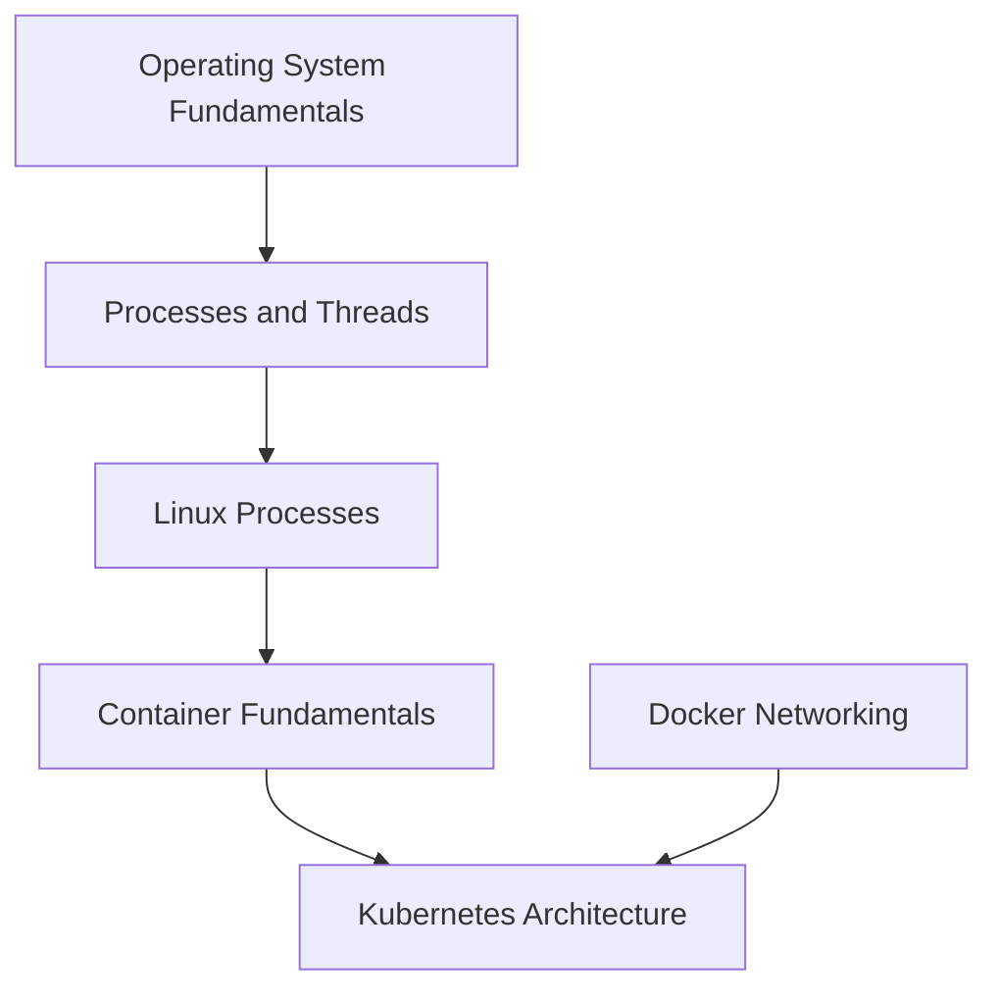
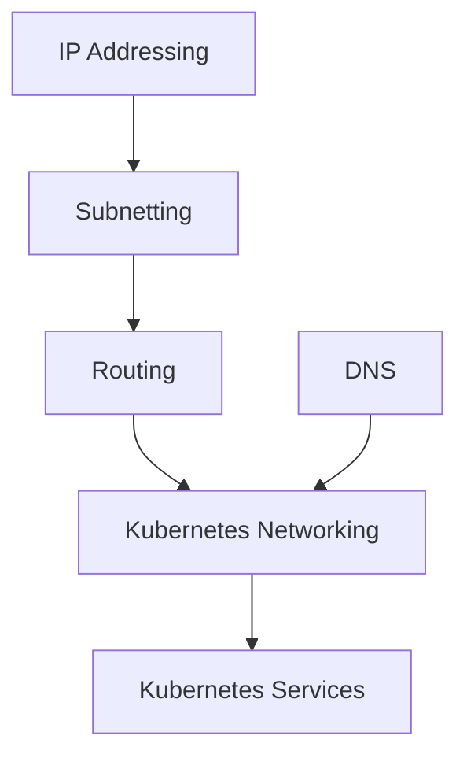
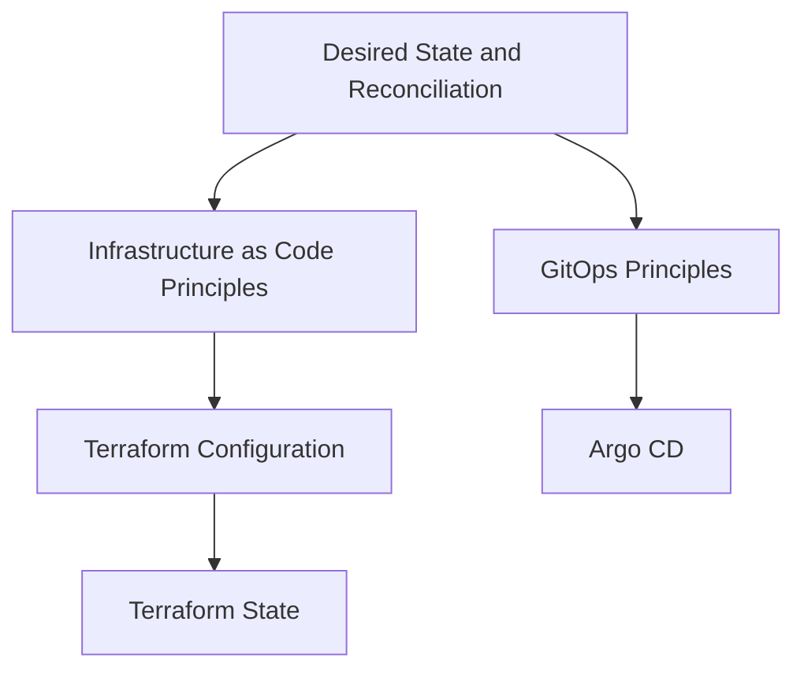
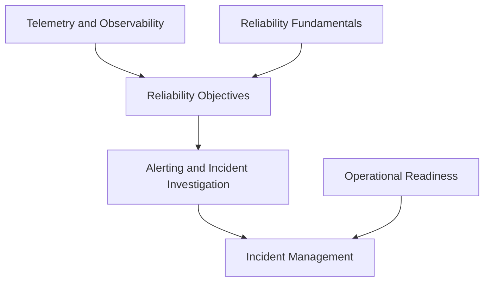

# Master Curriculum

<!-- Generated from curriculum.yaml; do not edit this map directly. -->

Phases are a reading guide, not prerequisite gates. Start security with system access, telemetry with your first programs, and reliability with your first cloud designs. Linux and networking can develop in parallel. Consult topic prerequisites before choosing a branch.

Each subject groups meaningful topics; the indented concept lists describe their scope. Most topics initially live in their domain map. Six representative topics have detailed notes.

## Phase 0 — Foundations

### [Foundations](00-foundations/README.md)

Build the vocabulary and reasoning skills used throughout computing.

#### Computing Literacy

- [Computer Fundamentals](00-foundations/README.md#computer-fundamentals) — Hardware and software; Input and output; Binary; Bits and bytes; Units and encodings.

#### Programming Basics

- [Programming Fundamentals](00-foundations/README.md#programming-fundamentals) — Variables; Data types; Control flow; Functions; Error handling.
- [Data Structures and Algorithms](00-foundations/README.md#data-structures-algorithms) — Arrays; Lists; Maps; Trees; Searching; Sorting; Complexity.

### [Computer Systems](01-computer-systems/README.md)

Understand how hardware executes programs and where resource limits arise.

#### Hardware and Execution

- [Computer Architecture](01-computer-systems/README.md#computer-architecture) — CPU; Instruction execution; Caches; Memory; Storage; I/O.
- [Systems Performance](01-computer-systems/README.md#systems-performance) — Locality; CPU bottlenecks; Memory bandwidth; Storage latency.

### [Operating Systems](02-operating-systems/README.md)

Understand resource isolation, scheduling, and the interfaces between programs and hardware.

#### Operating System Mechanics

- [Operating System Fundamentals](02-operating-systems/README.md#os-fundamentals) — Kernel; User space; System calls; Interrupts; Filesystems.
- [Processes and Threads](02-operating-systems/README.md#processes-threads) — Process address spaces; Threads; Scheduling; Context switching.
- [Memory Management](02-operating-systems/README.md#memory-management) — Virtual memory; Paging; Allocation; Page faults; Swap.
- [Concurrency](02-operating-systems/README.md#concurrency) — Race conditions; Locks; Deadlocks; Synchronization; Parallelism.

## Phase 1 — Systems

### [Linux](03-linux/README.md)

Operate Linux systems and diagnose their behavior using operating system concepts.

#### System Fundamentals

- [Linux Filesystem](03-linux/README.md#linux-filesystem) — Files; Directories; Inodes; Mounts; Paths; Package management.
- [Linux Users and Permissions](03-linux/README.md#linux-users-permissions) — Users; Groups; Ownership; Mode bits; sudo; ACLs.
- [Linux Shell](03-linux/README.md#linux-shell) — Shell; Bash; Environment variables; Pipes; Redirection; Exit codes.

#### Runtime and Operations

- [Linux Processes](03-linux/README.md#linux-processes) — Process inspection; Threads; Signals; File descriptors; /proc.
- [Linux Services](03-linux/README.md#linux-services) — systemd; Units; Service lifecycle; Dependencies; Journal logs.
- [Linux Networking](03-linux/README.md#linux-networking) — Interfaces; Routes; Sockets; Resolver configuration; DNS resolution; SSH.
- [Linux Troubleshooting](03-linux/README.md#linux-troubleshooting) — Logs; CPU saturation; Memory pressure; Disk exhaustion; Socket inspection.

### [Networking](04-networking/README.md)

Understand communication from local links through application protocols and traffic management.

#### Models and Local Links

- [OSI Model](04-networking/README.md#osi-model) — Layers; Encapsulation; Model limitations.
- [TCP-IP Model](04-networking/README.md#tcp-ip) — Link layer; Internet layer; Transport layer; Application layer.
- [Ethernet](04-networking/README.md#ethernet) — Frames; MAC addresses; Switching; ARP.

#### Addressing and Routing

- [IP Addressing](04-networking/ip-addressing.md) — IP; IPv4; IPv6; Public and private addresses; DHCP.
- [Subnetting](04-networking/subnetting.md) — CIDR; Prefixes; Subnet boundaries; IPv4 and IPv6 allocation.
- [Routing](04-networking/README.md#routing) — Route lookup; Longest-prefix match; Default gateways; Route tables.
- [NAT](04-networking/README.md#nat) — Source NAT; Destination NAT; Connection tracking; Port translation.

#### Transport and Application Protocols

- [TCP](04-networking/README.md#tcp) — Ports; Three-way handshake; Sequence numbers; Retransmission; Flow and congestion control.
- [UDP](04-networking/README.md#udp) — Datagrams; Ports; Loss; Application-managed reliability.
- [DNS](04-networking/dns.md) — Zones; Records; Recursive resolution; Authoritative servers; Caching; TTL.
- [HTTP](04-networking/README.md#http) — Methods; Status codes; Headers; Caching semantics; HTTPS; Connection reuse.
- [TLS](04-networking/README.md#tls) — Handshake; Certificates; Peer verification; Transport encryption.

#### Traffic Management and Diagnosis

- [Proxies and Load Balancing](04-networking/README.md#proxies-load-balancing) — Forward proxy; Reverse proxy; L4 and L7 balancing; Health checks.
- [Network Troubleshooting](04-networking/README.md#network-troubleshooting) — Layered diagnosis; Packet capture; DNS failures; Connection timeouts.

## Phase 2 — Software and Automation

### [Programming and Scripting](05-programming/README.md)

Turn programming fundamentals into reliable automation and maintainable programs.

#### Automation Languages

- [Python Automation](05-programming/README.md#python-automation) — Functions and modules; File I/O; Exceptions; Environments; API clients.
- [Shell Automation](05-programming/README.md#shell-automation) — Quoting; Pipelines; Exit handling; Script interfaces; Safe retries.

#### Program Runtime

- [Program Dependencies and Packaging](05-programming/README.md#program-dependencies) — Libraries; Dependency resolution; Lockfiles; Packaging; Distribution.
- [Network Programming](05-programming/README.md#network-programming) — Sockets; HTTP clients; Timeouts; Serialization.

### [Software Engineering](06-software-engineering/README.md)

Design, test, and evolve software with explicit interfaces and maintainability.

#### Design and Delivery Foundations

- [Software Lifecycle and Requirements](06-software-engineering/README.md#software-lifecycle) — SDLC; Requirements; Feedback; Change management.
- [Software Design Principles](06-software-engineering/README.md#software-design) — Architecture; Cohesion; Coupling; SOLID; Interface design.
- [API Design](06-software-engineering/README.md#api-design) — REST; Contracts; Versioning; Authentication; Authorization; Error handling.

#### Quality and Distribution

- [Software Testing](06-software-engineering/README.md#software-testing) — Unit testing; Integration testing; End-to-end testing; Test doubles.
- [Application Diagnostics](06-software-engineering/README.md#application-diagnostics) — Structured logging; Error context; Correlation identifiers.

### [Git and Version Control](07-git/README.md)

Understand history, collaboration, and reproducible source changes.

#### History and Collaboration

- [Git Fundamentals](07-git/README.md#git-fundamentals) — Working tree; Index; Commits; Remote repositories; Tags.
- [Git Branching and Integration](07-git/README.md#git-branching) — Branches; Merge; Rebase; Cherry-pick; Merge conflicts.
- [Git Workflows](07-git/README.md#git-workflows) — Pull requests; Reviews; Trunk-based development; Release branches.

#### Internals

- [Git Internals](07-git/README.md#git-internals) — Objects; Trees; Refs; Commit DAG; Reflog.

### [Databases and Data](08-databases/README.md)

Model, persist, query, and recover data with explicit integrity guarantees.

#### Models and Queries

- [Data Modeling](08-databases/README.md#data-modeling) — Entities; Relationships; Keys; Relational and document models.
- [SQL and Indexes](08-databases/README.md#sql-indexes) — Queries; Joins; Index structures; Query plans.

#### Integrity and Operations

- [Database Transactions](08-databases/README.md#database-transactions) — ACID; Isolation; Locking; MVCC.
- [Database Operations](08-databases/README.md#database-operations) — Migrations; Connection pools; Backup consistency; Restore verification.

## Phase 3 — Infrastructure

### [Virtualization and Containers](09-containers/README.md)

Understand workload isolation, image distribution, and container runtime behavior.

#### Isolation and Runtime

- [Virtualization](09-containers/README.md#virtualization) — Hypervisors; Virtual machines; Guest kernels.
- [Container Fundamentals](09-containers/README.md#container-fundamentals) — Namespaces; cgroups; Shared kernel; OCI; Docker; Container runtimes.

#### Images and Runtime Resources

- [Container Images](09-containers/README.md#container-images) — Layers; Dockerfile; ENTRYPOINT; CMD; Multi-stage builds; Registries.
- [Container Storage](09-containers/README.md#container-storage) — Writable layers; Bind mounts; Volumes; Persistence.
- [Docker Networking](09-containers/README.md#docker-networking) — Network namespaces; Bridges; Port publishing; Embedded DNS.
- [Container Troubleshooting](09-containers/README.md#container-troubleshooting) — Exit codes; Resource limits; Image failures; Connectivity failures.

### [Cloud Computing](10-cloud/README.md)

Understand cloud service models, failure boundaries, and resource economics.

#### Service and Resource Models

- [Cloud Fundamentals](10-cloud/README.md#cloud-fundamentals) — Service models; Regions; Availability zones; Shared responsibility; Compute; Storage; Networking; Managed databases.
- [Cloud Architecture](10-cloud/README.md#cloud-architecture) — Scalability; High availability; Failure domains; Managed services.

#### Governance and Economics

- [Cloud Governance and Cost](10-cloud/README.md#cloud-governance) — Account boundaries; IAM application; Metering; Cost allocation; Budgets; Cloud security.

### [AWS](11-aws/README.md)

Map transferable cloud concepts onto AWS service boundaries and operational choices.

#### Identity and Network Foundation

- [AWS IAM and Organizations](11-aws/README.md#aws-iam) — Policies; Roles; Federation; Organizations; Service control policies.
- [AWS VPC](11-aws/README.md#aws-vpc) — Subnets; Route tables; Internet Gateway; NAT Gateway; Security Groups; NACLs.

#### Compute Data and Traffic

- [AWS Compute](11-aws/README.md#aws-compute) — EC2; AMIs; EBS; Auto Scaling; Lambda.
- [AWS Data Services](11-aws/README.md#aws-data) — S3; RDS; DynamoDB; Durability; Access patterns.
- [AWS Traffic and DNS](11-aws/README.md#aws-traffic) — ALB; NLB; Route 53; Routing policies.
- [AWS Messaging](11-aws/README.md#aws-messaging) — SQS; SNS; Delivery semantics; Dead-letter queues.

#### Operations and Managed Kubernetes

- [AWS Operations and Secrets](11-aws/README.md#aws-operations) — CloudWatch; CloudTrail; Secrets Manager; KMS.
- [AWS EKS](11-aws/README.md#aws-eks) — Managed control plane; Worker nodes; Network integration; Access; Upgrades.

### [Infrastructure as Code](12-infrastructure-as-code/README.md)

Describe desired infrastructure and manage changes, state, dependencies, and drift.

#### Conceptual Foundations

- [Desired State and Reconciliation](12-infrastructure-as-code/README.md#desired-state) — Declarative configuration; Observed state; Reconciliation; Drift.
- [Infrastructure as Code Principles](12-infrastructure-as-code/README.md#infrastructure-as-code-principles) — Resource graph; Planning; Change review; Lifecycle; Infrastructure ownership.

#### Terraform Implementation

- [Terraform Configuration](12-infrastructure-as-code/README.md#terraform-configuration) — Providers; Resources; Data sources; Variables; Outputs; Locals; Dependency graph; Lifecycle.
- [Terraform State](12-infrastructure-as-code/terraform-state.md) — Resource bindings; Remote state; State locking; Import; Drift; Sensitive data.
- [Terraform Modules and Environments](12-infrastructure-as-code/README.md#terraform-modules) — Modules; Contracts; Workspaces; Environment isolation.
- [Infrastructure Testing and Delivery](12-infrastructure-as-code/README.md#infrastructure-testing) — Validation; Plan review; Policy; Terraform CI/CD; Integration testing.

### [Configuration Management](13-configuration-management/README.md)

Converge host configuration through repeatable, testable automation.

#### Configuration Concepts

- [Configuration Management Principles](13-configuration-management/README.md#configuration-management-principles) — Host configuration; Convergence; Inventory; Configuration drift.

#### Ansible Implementation

- [Ansible Automation](13-configuration-management/README.md#ansible-automation) — Inventory; Playbooks; Variables; Roles; Templates; Handlers; Secrets; Ansible automation.
- [Configuration Testing](13-configuration-management/README.md#configuration-testing) — Molecule; Idempotence tests; Check mode limitations; Integration environments.

## Phase 4 — Platforms and Delivery

### [Kubernetes and Container Orchestration](14-kubernetes/README.md)

Understand orchestration through the API, reconciliation, workload resources, and cluster operations.

#### Fundamentals Architecture and Objects

- [Kubernetes Architecture](14-kubernetes/README.md#kubernetes-architecture) — Orchestration; Control plane; API server; etcd; Scheduler; Controller manager; kubelet; kube-proxy.
- [Kubernetes Objects and Access](14-kubernetes/README.md#kubernetes-objects) — Objects; Namespaces; Contexts; kubectl; Labels; Selectors.
- [Kubernetes Pods and Workloads](14-kubernetes/README.md#kubernetes-pods) — Pods; ReplicaSets; Deployments; StatefulSets; DaemonSets; Jobs; CronJobs.

#### Networking and Storage

- [Kubernetes Networking](14-kubernetes/README.md#kubernetes-networking) — Pod networking; CNI; CoreDNS; Service discovery.
- [Kubernetes Services](14-kubernetes/kubernetes-services.md) — ClusterIP; NodePort; LoadBalancer; EndpointSlices; Selectors.
- [Kubernetes Ingress and Gateway API](14-kubernetes/README.md#kubernetes-ingress) — Ingress; Ingress controllers; Gateway API; HTTP routing.
- [Kubernetes Storage](14-kubernetes/README.md#kubernetes-storage) — CSI; Volumes; PV; PVC; StorageClass; Access modes.

#### Configuration Scheduling and Security

- [Kubernetes Configuration](14-kubernetes/README.md#kubernetes-configuration) — ConfigMaps; Secrets; Configuration delivery; Rollouts.
- [Kubernetes Scheduling and Resources](14-kubernetes/README.md#kubernetes-scheduling) — Taints; Tolerations; Affinity; Requests; Limits; HPA; VPA.
- [Kubernetes Security](14-kubernetes/README.md#kubernetes-security) — RBAC; ServiceAccounts; NetworkPolicy; Admission; Pod security.

#### Diagnosis Extensions and Architecture

- [Kubernetes Troubleshooting](14-kubernetes/README.md#kubernetes-troubleshooting) — Events; Logs; Pending Pods; Crash loops; DNS; Storage diagnosis.
- [Kubernetes Extensions](14-kubernetes/README.md#kubernetes-extensions) — CRDs; Operators; Webhooks; Controller reconciliation.
- [Kubernetes Cluster Architecture and Operations](14-kubernetes/README.md#kubernetes-cluster-operations) — Control-plane availability; Upgrades; Backup; Node maintenance; Production operations.

### [CI-CD](15-ci-cd/README.md)

Build and validate changes, produce artifacts, and deploy them with controlled exposure.

#### Continuous Integration

- [Continuous Integration](15-ci-cd/README.md#ci-fundamentals) — Build; Test; Feedback; GitHub Actions; GitLab CI; Jenkins; Runners and agents.
- [Artifact Management](15-ci-cd/README.md#artifact-management) — Immutable artifacts; Versioning; Container build pipelines; Promotion.

#### Continuous Delivery

- [Deployment Strategies](15-ci-cd/README.md#deployment-strategies) — Continuous delivery; Continuous deployment; Rolling deployment; Blue-green; Canary; Rollback.
- [Pipeline Security](15-ci-cd/README.md#pipeline-security) — Runner isolation; Secrets; Permissions; Provenance; Untrusted contributions.

### [GitOps](16-gitops/README.md)

Apply versioned desired state through reconciliation with clear ownership and recovery paths.

#### Principles and Configuration

- [GitOps Principles](16-gitops/README.md#gitops-principles) — Versioned desired state; Pull-based delivery; Reconciliation; Drift; Ownership.
- [Helm and Kustomize](16-gitops/README.md#helm-kustomize) — Charts; Values; Templates; Bases; Overlays; Rendered configuration.

#### Controllers and Diagnosis

- [Argo CD](16-gitops/README.md#argo-cd) — Application; ApplicationSet; Sync; Sync waves; Health; Drift.
- [GitOps Troubleshooting](16-gitops/README.md#gitops-troubleshooting) — Render failures; Sync failures; Health checks; Competing controllers.

## Phase 5 — Production Engineering

### [Observability](17-observability/README.md)

Use telemetry to explain system behavior and support actionable diagnosis.

#### Signals and Instrumentation

- [Telemetry and Observability](17-observability/README.md#telemetry) — Monitoring; Metrics; Logs; Traces; Signal context; Instrumentation.
- [OpenTelemetry](17-observability/README.md#opentelemetry) — Instrumentation; Context propagation; Collectors; Exporters.

#### Monitoring and Investigation

- [Prometheus and Grafana](17-observability/README.md#prometheus-grafana) — Scraping; Time series; Labels; PromQL; Dashboards; Cardinality.
- [Alerting and Incident Investigation](17-observability/README.md#alerting-investigation) — Actionable alerts; Symptoms; Correlation; Investigation queries.

### [Security](18-security/README.md)

Understand trust, identities, threat boundaries, and safeguards across systems.

#### Trust and Identity

- [Security Fundamentals](18-security/README.md#security-fundamentals) — Threat modeling; Least privilege; Defense in depth; Zero Trust concepts.
- [Identity and Access Management](18-security/identity-access.md) — Identity; Authentication; Authorization; IAM; RBAC; Federation; OIDC; SAML.
- [Cryptography and PKI](18-security/README.md#pki) — Encryption; Hashing; Signatures; Certificates; Trust chains; PKI.
- [Secrets and Key Management](18-security/README.md#secrets-key-management) — Secret lifecycle; Rotation; Encryption keys; Envelope encryption.

#### System and Delivery Controls

- [Network Security](18-security/README.md#network-security) — Firewalls; Segmentation; Trust boundaries; Stateful filtering.
- [Container Security](18-security/README.md#container-security) — Image security; Runtime privileges; Vulnerability management.
- [Supply Chain Security](18-security/README.md#supply-chain-security) — Dependency trust; SBOM; Signing; Provenance; Vulnerability response.
- [Policy as Code](18-security/README.md#policy-as-code) — Policy evaluation; OPA; Gatekeeper; Audit and enforcement.

### [Distributed Systems](19-distributed-systems/README.md)

Reason about partial failure, state coordination, and communication between independent nodes.

#### Failure and State

- [Distributed Systems Fundamentals](19-distributed-systems/README.md#distributed-fundamentals) — Partial failure; Time; Network partitions; CAP theorem; Consistency; Availability; Partition tolerance.
- [Replication and Consensus](19-distributed-systems/README.md#replication-consensus) — Replication; Leader election; Consensus; Quorum.
- [Partitioning and Sharding](19-distributed-systems/README.md#partitioning-sharding) — Partition keys; Hotspots; Rebalancing; Ownership.

#### Communication and Reliability

- [Messaging and Event-Driven Architecture](19-distributed-systems/README.md#messaging) — Queues; Pub-sub; Events; Ordering; Delivery guarantees.
- [Idempotency](19-distributed-systems/README.md#idempotency) — Repeated operations; Stable effects; Deduplication keys; Safe automation.
- [Resilient Communication](19-distributed-systems/README.md#resilient-communication) — Timeouts; Retries; Backoff; Jitter; Circuit breakers.
- [Distributed Transactions](19-distributed-systems/README.md#distributed-transactions) — Atomic commit; Sagas; Outbox; Compensation.

### [Site Reliability Engineering](20-sre/README.md)

Translate user expectations into reliability decisions and sustainable operations.

#### Reliability Foundations

- [Reliability Fundamentals](20-sre/README.md#reliability-fundamentals) — Reliability; Availability; Failure domains; Redundancy.
- [Reliability Objectives](20-sre/README.md#reliability-objectives) — SLI; SLO; SLA; Error budgets; User journeys.

#### Capacity and Resilience

- [Capacity and Performance](20-sre/README.md#capacity-performance) — Capacity planning; Saturation; Scaling; Performance; Load tests.
- [Resilience Engineering](20-sre/README.md#resilience-engineering) — Resilience; Chaos engineering; Hypotheses; Blast radius; Recovery verification.

### [System Design](21-system-design/README.md)

Combine concepts into architectures with explicit requirements and tradeoffs.

#### Requirements and Estimation

- [System Design Method](21-system-design/README.md#system-design-method) — Functional requirements; Non-functional requirements; Latency; Throughput; Capacity estimation; High-level architecture; Low-level design; Tradeoffs.

#### Architecture Patterns and Tradeoffs

- [Caching](21-system-design/README.md#caching) — Cache keys; Invalidation; TTL; Eviction; Stampedes.
- [Scalable Architecture](21-system-design/README.md#scalable-architecture) — Horizontal scaling; Vertical scaling; Databases; Load balancing; Queues; Event-driven systems; Replication; Consistency; Failure modes.

### [Production Operations](22-production-operations/README.md)

Operate services through incidents, changes, and tested recovery procedures.

#### Readiness and Change

- [Operational Readiness](22-production-operations/README.md#operational-readiness) — Runbooks; Ownership; On-call; Handoffs; Safe changes.
- [Backup and Disaster Recovery](22-production-operations/README.md#backup-recovery) — Backup; Restore; Recovery; RPO; RTO; Disaster recovery; Restore exercises.

#### Response and Learning

- [Incident Management](22-production-operations/README.md#incident-management) — Triage; Coordination; Communication; Mitigation; RCA; Blameless learning.

## Phase 6 — Specialization

### [Advanced and Specialization](23-advanced/README.md)

Select deeper paths after mastering their foundations; expand from actual needs.

#### Specialization Paths

- [Platform Engineering](23-advanced/README.md#platform-engineering) — Self-service interfaces; Golden paths; Platform contracts; Developer experience.
- [Systems Performance Specialization](23-advanced/README.md#performance-specialization) — Profiling; Workload characterization; Cross-layer bottlenecks.

## Cross-domain Dependency Sketches

These show selected direct prerequisites. Related and implementation links do not imply a learning gate.

### Systems to orchestration

### Addressing to service networking

### Declarative delivery

### Reliability to operations

